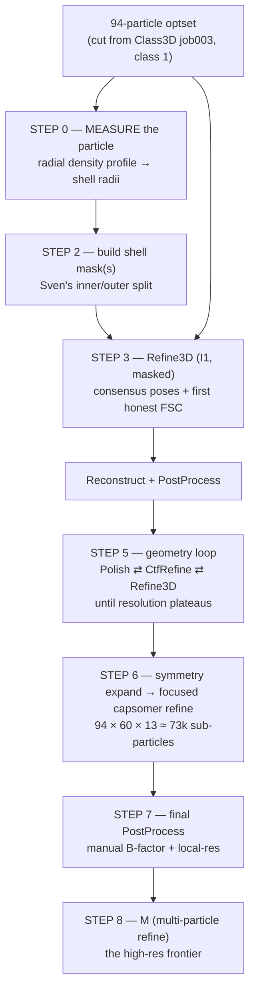

# 412 capsid — STA refinement playbook (aggregation → sub-nanometer)

*The job-by-job sequel to [`412-capsid-aggregation-handoff.md`](412-capsid-aggregation-handoff.md).
That doc got us to **94 clean particles @ 16.3 Å** (Class3D winner). This doc drives them to the
best-resolution average we can get, in RELION-5 tomo + M, and explains **why** at each step so the
arcane parts stop being arcane.*

*Grounded in Sven/Florian's CryoBoost tutorial (the Copia recipe — Copia is 412's sister
retrotransposon capsid, same I1 workflow) and Sven's inner/outer-shell masking guidance.
Refinement runs in **RELION / M**, not crboost — crboost's job was aggregation + the honest
starting model, and that's done.*

> 🤝 **Working agreement — this whole effort is *external* to crboost.** We run it in **RELION / M and
> whatever else helps, straight from Apptainer containers**; we do **not** add code or job types to
> crboost for it. crboost's role ended at aggregation (the 94-particle optset + the honest starting map).
> Artem has spare containers for RELION/M/etc. beyond the ones in `config/conf.yaml` — if a step wants a
> specific build, ask.
>
> **Claude's sandbox has no `/groups` mount, no python, and no container runtime**, so the exact paths,
> `relion_image_handler --stats`, the radii, the RELION version, and the M check are all **yours to run
> and paste back**. On restart the 412 project dir gets bind-mounted — that lets Claude **read the star
> files and cut the 94-particle subset directly**, but *not* run RELION/numpy/apptainer. Bring-up
> commands (full paths) are in **§11**.

---

## 0. The whole arc in one picture



**The mental model in four ideas** (everything below is just these, applied):

1. **Gold-standard FSC keeps you honest.** Refine3D splits your particles into two independent
   half-sets and never lets one see the other. The resolution it reports (FSC = 0.143) is therefore
   *real*, not wishful — unlike Class3D's number, which is alignment-limited and optimistic. This is
   why 16.3 Å from Class3D is a floor, not a verdict.
2. **Low-pass the reference or you'll hallucinate.** Feed a refinement a sharp reference and it will
   "find" that reference in pure noise (*Einstein-from-noise*). Always low-pass the starting map so
   the *data*, not the reference, decides the high-res detail. This is why we use **your** class001
   low-passed — never Sven's high-res template — as the input.
3. **Symmetry is free signal.** An icosahedral capsid carries **60 identical copies** of itself.
   Imposing I1 averages all 60 → your 94 particles punch like ~5,640. Expanding that symmetry later
   (Step 6) lets each copy be refined on its own → the path to sub-nm.
4. **Bin for decisions, unbin for measurement.** (See [`binning-and-resolution.md`](binning-and-resolution.md).)
   Coarse pixels are fine for sorting/rough alignment; the final resolution-defining steps must run
   on fine pixels. We refine at a moderate bin and drop to bin 1 only for the last push.

---

## 1. Inputs & standing conventions

From the handoff — these are fixed for the whole pipeline:

| Thing | Value |
| --- | --- |
| Particles | **94** (Class3D job003, `rlnClassNumber == 1`) |
| Symmetry | **I1** (keep this convention *everywhere* — it's what job002/003 + the boss recipe used) |
| Unbinned box / apix | **600 px @ 1.55 Å/px** (bin 1) |
| Particle diameter | **550 Å** (≈ 355 px at bin 1) |
| Mask diameter (RELION arg) | **575 Å** |
| Current best map | `External/job003/run_it015_class001.mrc` (600 px, 1.55 Å/px, 94 ptcls, 16.3 Å) |
| Refine working box | **bin 1: box 600 @ 1.55 Å** for the first consensus refine — it's the existing extraction, and Class3D (job003) already refined 3 classes there, so it's proven; ref + mask are already 600/1.55 → **no rescale**. Re-extract at **bin 2** (box 384 / 3.1 Å/px) only if the Step-5 loop needs the speed. |
| RELION | **5.0.1** (commit b16a35; confirmed 2026-07-02 via `rel relion_refine --version`). optimisation_set world. |

**Reference discipline (applies to every Refine3D/Class3D below):** input reference = your own map,
**low-passed**; rely on gold-standard FSC; Sven's `try1` template is a *cross-check only*
(`/groups/klumpe/user/sven.klumpe/Processing/412/try1/Class3D/job121/run_it015_class001.mrc`), never a
refinement input.

> ⚙️ **Running tools on this cluster — read before every code block below.** There is **no `module load`**
> here; RELION 5.0-tomo, IMOD, ChimeraX and Warp/M are Apptainer images under `/groups/klumpe/software/…`
> (see `config/conf.yaml → tools:`). Every RELION command in this doc runs *inside* the RELION image.
> Define this once per shell and prepend `rel` to the RELION commands:
>
> ```bash
> RELION5=/groups/klumpe/software/Setup/cryoboost_containers/relion5.0_tomo.sif
> rel() { apptainer exec --nv --cleanenv -B /groups -B /scratch -B /tmp "$RELION5" "$@"; }
> #   headless example:  rel relion_image_handler --i map.mrc --stats
> ```
>
> **The GUI** (the job-by-job Refine3D/Polish/CtfRefine flow) needs a display — drop `--cleanenv` and launch
> it *inside your VNC appliance session* (the same GPU-node setup as the ArtiaX picking viewer):
> ```bash
> apptainer exec --nv -B /groups -B /scratch -B /tmp "$RELION5" relion &   # add --tomo if your build wants the tomo menu
> ```
> RELION's *Running* tab needs a SLURM submit template — reuse crboost's `config/qsub.sh` (its
> `XXXextra1..8XXX` slots already map to Partition/Constraint/Nodes/Tasks/CPUs/GRES/Memory/Walltime).
>
> **EMAN2 is not installed** (no container, no `conf.yaml` tool entry), so the `e2proc3d.py` mask carves
> below are replaced by a small numpy shell-carve run *inside* the RELION image (it ships python + mrcfile)
> → `relion_mask_create` for softening. If Lmod happens to expose one (`module avail eman`), the original
> `e2proc3d` lines are equivalent.

---

## 2. STEP 0 — Measure the particle first *(decides the whole mask design)*

We don't yet know whether 412's interior is **a second ordered protein layer** (e.g. the capsid
protein's C-terminal-domain shell, the classic two-layer retroviral/retrotransposon lattice) or **a
disordered genome/RNA core** (like Copia, where the tutorial simply carves the inside out). That one
fact decides whether we build **two focused targets** or **one shell + an exclusion mask**. So measure
before masking.

### Run these on the cluster

```bash
cd /groups/klumpe/crboost_data/412_aggregation      # your 412 project (holds External/job003/)
MAP=External/job003/run_it015_class001.mrc

# (a) sanity: box, apix, min/max/mean  (confirm apix ≈ 1.55 — if it prints 0, the header is unset)
rel relion_image_handler --i "$MAP" --stats

# (b) radial density profile — the key readout (numpy, headless, no EMAN)
rel python3 - "$MAP" <<'PY'
import sys, numpy as np, mrcfile
with mrcfile.open(sys.argv[1], permissive=True) as m:
    d = np.asarray(m.data, dtype="float32"); apix = float(m.voxel_size.x)
c = np.array(d.shape) // 2                       # RELION box-center convention (even box)
z, y, x = np.indices(d.shape)
r = np.rint(np.sqrt((z-c[0])**2 + (y-c[1])**2 + (x-c[2])**2)).astype(int)
prof = np.bincount(r.ravel(), d.ravel()) / np.maximum(np.bincount(r.ravel()), 1)
print(f"# apix = {apix} A/px   box = {tuple(d.shape)}")
print("# r_px     r_A      mean_density")
for i, v in enumerate(prof):
    print(f"{i:5d} {i*apix:8.1f}  {v: .5f}")
PY
```

Read the three radii off that curve: density rises out of solvent → `R_in`; a *dip* inside the shell →
`R_mid` (two-layer case); density falls back to solvent → `R_out`. Visual cross-check in ChimeraX — launch
it the way your curation appliance does (GPU node + VNC), **not** on the headnode:

```bash
CX=/groups/klumpe/software/containers/sifs/chimerax_artiax_GL.sif
apptainer exec --nv -B /groups "$CX" vglrun -d egl chimerax &
#   in ChimeraX:  open <MAP> ; volume gaussian #1 sDev 2   (light smooth so the shells read cleanly)
```

*(The numpy profile is the source of truth; ChimeraX just lets you eyeball the shells. If `import mrcfile`
ever fails in the RELION image, read the radii off the ChimeraX view instead.)*

Either way, produce a **density-vs-radius curve** and read off (in **pixels at 1.55 Å/px**, then I'll
convert to whatever bin the mask needs):

| Symbol | Meaning | How to spot it |
| --- | --- | --- |
| `‹R_out›` | outer surface of the capsid | density falls to solvent going outward |
| `‹R_mid›` | boundary between outer & inner shells (**if two exist**) | a *dip* between two density peaks inside the shell |
| `‹R_in›`  | inner surface of ordered density | density falls to solvent/flat going inward |
| core | everything inside `‹R_in›` | flat/noisy = disordered genome |

### The decision (this is what your "not sure" answer routes into)

```
 radial profile shows...                         → mask design
 ─────────────────────────────────────────────    ─────────────────────────────────────
 TWO ordered peaks inside the shell               → TWO focused targets:
   (clear dip at R_mid)                              outer mask [R_mid..R_out]
                                                     inner mask [R_in..R_mid]
                                                     (+ full-shell mask [R_in..R_out] for consensus)

 ONE ordered shell + flat/noisy core              → exclusion-only (the Copia case):
   (smooth falloff toward center)                    one shell mask [R_in..R_out], carve core < R_in
```

**Deliverable of Step 0:** the three radii + which branch we're in.

> ✅ **RESULT (2026-07-02) — ONE-SHELL.** Radial profile (box 600 @ 1.55; solvent/mask = 0 beyond
> r≈184 px / 285 Å = the map's built-in ~575 Å-diameter mask):
> - **One dominant *positive* protein shell** — rises out of the lumen (zero-crossing ~125 Å / r≈81 px),
>   peaks **+8.9e-4 at ~183 Å (r≈118 px)**, falls through a ~240–250 Å plateau to a small negative ring
>   (~270 Å) then the mask. This is the capsid protein.
> - **Lumen (r < ~125 Å) is *negative* throughout** (−3e-4 → −8e-4, deepest at centre). A second
>   *ordered* protein layer would read **positive** — it doesn't → the interior is disordered/hollow
>   (genome/RNP), **not** a refinable inner shell.
> - Sub-features — a weak positive outer bump ~220 Å (dip ~204 Å) + a faint interior shoulder ~71 Å —
>   are **≪10 %** of the shell amplitude; **too weak at 16 Å to commit to a two-layer focused refine.**
>   Revisit the inner/outer split (Step 6) only if they sharpen into real peaks after Step 3/5.
>
> **→ Branch = ONE-SHELL.** `R_in ≈ 120 Å` (≈77 px, inner protein surface) · `R_out ≈ 250 Å` (≈161 px,
> outer falloff) · map already masked ~285 Å (184 px). For the *consensus* mask these are diagnostic
> only — the mask is **threshold-only** (lumen is negative → auto-excluded); see the Step-2 FINALIZED
> callout. The radii feed the *focused* inner/outer masks only if we later take the two-layer branch.

> Why this gates everything: the mask is the object that tells cross-correlation *what to align on*.
> Get the radii wrong and you either include disordered core (alignment chases noise) or clip real
> shell density (you throw away signal). This is the single most consequential number-fetch in the
> playbook.

---

## 3. STEP 1 — Cut the 94-particle optset

> ✅ **DONE (2026-07-02, cut directly from the mounted project).** The surgical route below was used:
> `run_it015_data.star` filtered to `rlnClassNumber==1`. Verified — **94 rows, all class-1, all 24
> fields**; the `data_general`/`data_optics`/loop-header blocks are **byte-for-byte identical** to
> RELION's output; the optics row confirms **300 kV · Cs 2.7 · ampl 0.1 · 1.55 Å/px · box 600 · bin 1**
> (so §1's conventions are now runtime-verified, not assumed). The 94 span **57 tilt-series** (max 16 in
> one, most just 1 — see the Step-5 caveat); all 57 are present in `tomograms.star`. Carry forward:
>
> ```
> optimisation_set : /groups/klumpe/crboost_data/412_aggregation/sta_refine/optimisation_set.star
> particles (94)   : /groups/klumpe/crboost_data/412_aggregation/sta_refine/particles.star
> tomograms (shared): /groups/klumpe/crboost_data/412_aggregation/MergedSources/merge-20260626-132413/tomograms.star
> ```
> All paths inside are **absolute** → the subset is relocatable (move `sta_refine/`, or use `$PROJ` as the
> RELION project root — either resolves). External to crboost; nothing in the pipeline references it.

Refine3D refines **every** particle you give it; feed it all 112 and the 18 junk come back. So subset
to class 1 first. Two equivalent routes:

- **RELION Subset selection** job on `External/job003/` → select class 1 → it writes the class-1
  `particles.star` + a matching `optimisation_set.star`. Cleanest, keeps provenance.
- **Surgical star edit** (I can generate this for you): filter `run_it015_data.star` to
  `rlnClassNumber == 1` (94 rows) and rewrite the optimisation_set to point at it.

Output you carry forward: **`optimisation_set.star` → `particles.star` (94 rows)** + the shared
`tomograms.star`.

---

## 4. STEP 2 — Build the shell mask(s) *(Sven's inner/outer step)*

This is the exact mechanic from the tutorial's *Mask creation* — carve the map with a hard radial cut,
then soften with `relion_mask_create`. We just parameterize it with **your** Step-0 radii and, if the
profile shows two layers, make the complementary pair.

> ⚠️ **apix/box gotcha:** a mask must live at the **same box & pixel size as the map it's applied to.**
> Your class map is 600 px @ 1.55; your first refinement runs at bin 2 (224 crop @ 3.1). Either build
> the mask on a map already at the refinement sampling, or `relion_image_handler --rescale`/`--new_box`
> the mask to match. Mismatched masks silently misalign — a classic time sink.

> ✅ **FINALIZED for 412 (2026-07-02) — Step-3 consensus mask is threshold-only, NO carve.** Step 0 came
> back **one-shell** over a *negative* lumen (see §2 Step 0 RESULT). Because the lumen is negative, a
> positive density threshold excludes it on its own — the `carve_shell.py` route below is only needed for
> the Step-6 focused inner/outer split (which we're deferring). Build straight from the class map at its
> native **600 px / 1.55 Å**, which is also the refinement box (§1: we refine at bin 1) → **no rescale**:
>
> ```bash
> MAP=/groups/klumpe/crboost_data/412_aggregation/External/job003/run_it015_class001.mrc
> cd /groups/klumpe/crboost_data/412_aggregation/sta_refine
> rel relion_mask_create --i "$MAP" --o mask_shell.mrc \
>     --lowpass 18 --ini_threshold 0.0005 --extend_inimask 5 --width_soft_edge 7 --angpix 1.55 --j 4
> rel relion_image_handler --i mask_shell.mrc --stats   # mask mean = enclosed fraction; hollow shell ~0.07–0.09
> ```
> `0.0005` is data-driven (radial shell-mean peaks at 8.9e-4). Fills the centre → raise it; broken/patchy
> → lower it. **The `--ini_threshold 0.15` in the template below is an *absolute* value → selects nothing
> on this map (peak ≈ 9e-4). Use the 412 number above, not 0.15.**
>
> ✅ **BUILT 2026-07-02:** `mask_shell.mrc` → `avg 0.0871, min 0, max 1` = clean soft hollow shell,
> green-lit for Refine3D. (Expected ~**0.07–0.09** for a hollow capsid shell `[R_in..R_out]` — *not* the
> 0.10–0.20 of a solid blob; the lumen is excluded. Geometry check: hard shell [120..250 Å] ≈ 0.072 of the
> box, + soft edge → 0.087. So if you rebuild and land in 0.07–0.09 you're right.)

```bash
# EMAN-free radial carve (runs inside the RELION image): keep density in [r_in, r_out] px, zero elsewhere.
# r_out = -1 means "no outer cap" — let relion_mask_create's density threshold set the outer bound.
cat > carve_shell.py <<'PY'
import sys, numpy as np, mrcfile
inp, outp, r_in, r_out = sys.argv[1], sys.argv[2], float(sys.argv[3]), float(sys.argv[4])
with mrcfile.open(inp, permissive=True) as m:
    d = np.asarray(m.data, dtype="float32"); vs = m.voxel_size
c = np.array(d.shape) // 2
z, y, x = np.indices(d.shape)
r = np.sqrt((z-c[0])**2 + (y-c[1])**2 + (x-c[2])**2)
keep = r >= r_in
if r_out > 0: keep &= r <= r_out
with mrcfile.new(outp, overwrite=True) as o:
    o.set_data(np.where(keep, d, 0).astype("float32")); o.voxel_size = vs
PY

# ---- FULL-SHELL mask (consensus Refine3D, Step 3) : carve core < R_in, keep the shell ----
rel python3 carve_shell.py "$MAP" vol4Mask_shell.mrc ‹R_in› -1
rel relion_mask_create --i vol4Mask_shell.mrc --o MaskCreate/shell/mask.mrc \
    --lowpass 18 --ini_threshold 0.15 --extend_inimask 5 --width_soft_edge 7 --angpix <apix>

# ---- OUTER-SHELL mask (focused refine, Step 6) : keep [R_mid..R_out] ----
rel python3 carve_shell.py "$MAP" vol4Mask_outer.mrc ‹R_mid› -1
rel relion_mask_create --i vol4Mask_outer.mrc --o MaskCreate/outer/mask.mrc \
    --lowpass 18 --ini_threshold 0.15 --extend_inimask 5 --width_soft_edge 7 --angpix <apix>

# ---- INNER-SHELL mask (focused refine, Step 6) : keep [R_in..R_mid] — two-layer branch only ----
rel python3 carve_shell.py "$MAP" vol4Mask_inner.mrc ‹R_in› ‹R_mid›
rel relion_mask_create --i vol4Mask_inner.mrc --o MaskCreate/inner/mask.mrc \
    --lowpass 18 --ini_threshold 0.15 --extend_inimask 5 --width_soft_edge 7 --angpix <apix>
```

**Which mask when:**

| Mask | Radii | Used in |
| --- | --- | --- |
| full-shell | carve core `< R_in`, keep to `R_out` | Step 3 consensus Refine3D, all of Step 5 |
| outer-shell | `[R_mid .. R_out]` | Step 6 focused refine (outer target) |
| inner-shell | `[R_in .. R_mid]` | Step 6 focused refine (inner target) *(two-layer branch only)* |

**Why two focused masks (the biology):** in a two-layer CA lattice the outer and inner domains flex
relative to each other. One mask over both lets the stronger layer drag the alignment and smear the
other. Masking each layer alone makes cross-correlation "see" only that layer → each refines to its own
best pose. That's Sven's "so the alignment doesn't get confused by the other parts," verbatim.

---

## 5. STEP 3 — Consensus Refine3D (I1, masked)

First gold-standard refinement: honest FSC + poses good enough to feed the geometry loop.

```text
Input optimisation_set : sta_refine/optimisation_set.star           (94 ptcls, Step 1)
Reference map          : External/job003/run_it015_class001.mrc      (your winner, 600 px @ 1.55)
Reference mask         : sta_refine/mask_shell.mrc                   (one-shell, Step 2)
Symmetry               : I1
Box / bin              : 600 px @ 1.55 Å (bin 1 — the existing extraction; no re-extract, no rescale)
Initial low-pass       : 40 Å           (filter the reference hard — anti-Einstein-from-noise at N=94; Class3D used 45)
Angular search         : global auto-refine from 3.7°   (94 ptcls makes global cheap + robust; Class3D poses just seed it)
Mask diameter          : 575
Solvent-flattened FSC  : Yes
Reference on absolute greyscale : Yes
Pre-read particles into RAM / GPU : Yes / Yes   (~5–6 GB; drop GPU pre-read to No if it OOMs on gpu:1)
Submit to queue        : Yes
```

**Local vs global — pick one:**

- **Local (recommended, matches the tutorial):** you already have converged I1 poses from Class3D, so
  polish them. `Initial low-pass 16–20 Å · initial angular sampling 1.8° · offset range 2 · local
  searches 1.8°`. Faster, lower bias risk.
- **Global (your original plan):** if you distrust the Class3D poses, start wide. `Initial low-pass
  30–40 Å · sampling 3.7° global`. Safer against wrong poses, slower. Gold-standard FSC protects you
  either way.

> ▶ **HEADLESS CLI — no GUI (FINALIZED 2026-07-02).** The card above is reproduced by
> `sta_refine/run_refine3d.sh` (written + ready to `sbatch`). The key tomo flag — mined from the real
> command in `External/job003/run.out` that produced the 16.3 Å map — is **`--ios <optimisation_set.star>`**
> (NOT `--i`); that's how the optimisation set (particles + tomograms + trajectories) is passed. The script
> is the known-good Class3D invocation minus `--K/--iter/--firstiter_cc`, plus
> `--auto_refine --split_random_halves --low_resol_join_halves 40` and `--solvent_mask mask_shell.mrc
> --solvent_correct_fsc`.
>
> ⚠️ **MPI IS MANDATORY for gold-standard auto-refine** (learned the hard way 2026-07-02). The **serial**
> `relion_refine` aborts in ~1 min with `ERROR: Cannot split data into random halves without using MPI!`.
> Class3D ran serial only because *classification never splits half-sets* — auto-refine does. So the job
> uses **`mpirun -np 3 relion_refine_mpi`** (1 leader + 1 worker per half-set; the 3 ranks share the 1 GPU),
> launched *inside* the container (`apptainer exec … bash -lc "mpirun -np 3 relion_refine_mpi …"`), with
> `#SBATCH --ntasks=3 --cpus-per-task=4`. If the image lacks its own `mpirun`, fall back to host-launched
> `srun --mpi=pmix apptainer exec … relion_refine_mpi …`. Submit: `sbatch sta_refine/run_refine3d.sh`;
> watch `sta_refine/refine3d-*.out`; grep `Final resolution` for the FSC number.

**Then, immediately:** *Reconstruct particle* (I1, box 384 / crop 224) → *PostProcess* (reference
mask = full-shell). That PostProcess FSC is your **first real resolution number** — the baseline every
later step must beat.

---

## 6. STEP 5 — The geometry refinement loop *(the big tomo lever)*

This is what "iterate Refine3D with per-tilt CTF + frame/tilt alignment" actually is: a **fixed job
graph**, run in this order, looped. It's the tutorial's job019→029 chain.

```
Refine3D → Reconstruct → PostProcess
        → Polish  (frame + per-particle motion)  → Extract → Reconstruct → PostProcess
        → CtfRefine (per-tilt defocus; later aberrations) → Extract → Reconstruct → PostProcess
        → (back to Refine3D)   ⟲ repeat until the FSC stops moving
```

**Polish first, then CtfRefine** (tutorial order). Reference params:

| Job | Key params (from tutorial, adjust to 412) |
| --- | --- |
| **Polish** | box 256 · max position error 7 · **Fit per-particle motion: Yes** · `--it 30000` |
| **CtfRefine** | box 256 · defocus search range 6000 · defocus reg. λ 0.2 · (enable astigmatism/higher-order aberrations once resolution warrants) |
| **Reconstruct** | I1 · box 384 · crop 224 |
| **PostProcess** | reference mask = full-shell |

> ⚠️ **94 particles is thin here — and thinner than it looks.** The cut (Step 1) shows the 94 spread
> across **57 tilt-series, ~1.6 particles each** (only one series has 16; most have a single particle).
> Polish/CtfRefine fit geometry *per physical particle / per tilt-series* — and unlike averaging,
> **symmetry does not multiply your leverage** for these fits. With ~1–2 particles per series even the
> normally-robust **per-tilt defocus (CtfRefine) is weakly constrained**, and **per-particle motion
> (Polish) will be noisy or unfittable**. Practical order: try CtfRefine (defocus only, strong λ) first;
> if a Polish round makes the FSC *worse*, drop it. Watch for divergence; don't loop past the plateau
> (overfitting eats small datasets). This sparse-per-series geometry is also why **M (Step 8) — which
> co-refines all species in a series jointly — may not beat consensus Refine3D much until there are more
> particles per tilt-series.**

When the FSC plateaus, this consensus map is as far as vanilla whole-capsid refinement goes. The
remaining gains come from Step 6.

---

## 7. STEP 6 — Symmetry expansion → focused capsomer refinement *(the sub-nm win)*

This is the capsid-specific move and Sven's `94 × 60 × 13 ≈ 73k` arithmetic.

**What it does, conceptually:**

1. **Expand** the symmetry (`relion_particle_symmetry_expand --sym I1`): each of the 94 particles is
   written out as **60 oriented copies**, one per icosahedral asymmetric unit → 5,640 entries.
2. **Re-center on a capsomer.** Shift each copy's origin from the capsid center to a single capsomer
   (pentamer/hexamer) position, and **re-extract that sub-volume** as its own small particle. With ~13
   capsomers per asymmetric unit that's the ~73k sub-particles.
3. **Locally refine** the sub-particles with a **capsomer-sized mask** and the capsomer's **own local
   symmetry** (C5 at a pentamer, C6 at a hexamer). Small box, huge N, local searches → highest local
   resolution.

**The inner/outer split lands here most powerfully:** run the focused refinement **twice** —
`Reference mask = outer-shell` and `= inner-shell` — producing a clean map per layer.

> **Caveats worth stating up front (never fail silently):**
> - The **centering + I1 convention must be verified** before expansion; a wrong center symmetrizes to
>   mush. Confirm the map sits on the icosahedral origin (a quick I1-symmetrized vs unsymmetrized
>   overlay in ChimeraX is enough).
> - Sub-particle re-extraction/re-centering for **subtomograms** is fiddlier than for SPA and its exact
>   flow depends on your RELION-5 build. **DECIDED (2026-07-02): route Step 6 through M, not RELION 5.0.1.**
>   5.0.1's subtomo re-extraction at shifted centres is not a clean one-job flow, and **M is confirmed
>   present** (§9) and does capsomer localization natively (define the capsomer as a species) — so Step 8
>   absorbs Step 6: expand + re-centre + focused-refine all happen inside M.

---

## 8. STEP 7 — Final PostProcess + local resolution

```text
PostProcess : unfiltered half-maps from the last Reconstruct
              reference mask = the tight, honest mask (shell or capsomer)
              Estimate B-factor automatically : No          ← auto over-sharpens small sets
              Provide your own B-factor        : start ‹−75› (tutorial value; tune per FSC)
LocalRes    : per-voxel resolution map — tells you which parts earned their detail
```

The manual B-factor is not optional at N≈94: RELION's automatic B-factor is fit on the high-res FSC
tail, which is unstable with few particles and will over-sharpen. Set it by hand and sanity-check the
map isn't growing noise spikes.

---

## 9. STEP 8 — M (multi-particle refinement) — the frontier

You already live in WarpTools, so **M** is the natural high-res finisher. It jointly refines
per-particle poses, per-tilt CTF, and tilt-series geometry **against the map** in one optimization —
usually the biggest single jump past vanilla Refine3D, and the clean home for the **per-capsomer
species** (it does Step 6's localized reconstruction as a first-class feature). Push the Step-6/7 poses
into M, define the capsid (and each shell/capsomer) as species, and let it co-refine.

> ⚙️ **Reaching M on this cluster — ✅ CONFIRMED (2026-07-02).** The Warp image ships the M CLI:
> `MTools`, `MCore`, `WarpTools` all resolve under `/opt/conda/envs/warp/bin/` (bare `M` is the GUI, not
> needed — headless M runs via MTools/MCore). Image:
> `/groups/klumpe/software/Setup/cryoboost_containers/warp_2.0.0dev36_aretomo1.0.0_cuda11.8_glibc2.31.sif`.
> The non-trivial part is the *handoff*, not the install: M consumes Warp's population/species format, so
> the Step-6/7 RELION poses (`optimisation_set.star` → `particles.star`) must be converted back into a
> Warp/M project. Give me your RELION-5 point release + whether the 412 data still has its original Warp
> processing directory and I'll write the exact `WarpTools`/`MTools` handoff.

---

## 10. Checklist, red flags & expectations

**Do-in-order checklist**

- [ ] Step 0 radial profile → `R_in / R_mid / R_out` + one/two-layer decision *(gated on you — needs numpy/MRC)*
- [x] **Step 1 cut 94-particle optset — DONE** → `sta_refine/{optimisation_set,particles}.star` (94 rows, verified)
- [ ] Step 2 build mask(s) **at the refinement box/apix**
- [ ] Step 3 consensus Refine3D → first honest FSC (beat 16.3 Å)
- [ ] Step 5 geometry loop until plateau (CtfRefine reliable; Polish only if it helps)
- [ ] Verify center/convention → Step 6 symmetry-expand + focused (outer, and inner if two-layer)
- [ ] Step 7 manual B-factor + local-res
- [ ] Step 8 M for the frontier

**Red flags → what they mean**

| Symptom | Likely cause | Fix |
| --- | --- | --- |
| FSC "improves" but map = your reference | Einstein-from-noise (reference too sharp) | low-pass the reference harder; trust gold-standard FSC only |
| Symmetrized map is mush | off-center / wrong I-convention | re-center before expansion; confirm I1 axis |
| Refinement drifts/worsens | 94 particles overfitting | fewer iterations, wider mask, drop Polish |
| One shell smears the other | single mask over both layers | the inner/outer split (Step 2/6) |
| Map clipped at edges | mask apix ≠ map apix | rescale the mask to the working box |

**Resolution expectations (honest):** 16.3 Å now is alignment-limited. Consensus Refine3D + geometry
loop should get you into the ~8–12 Å band (Copia hit 7.5–8.5 Å on this exact recipe). The focused
capsomer step + M is where sub-nm becomes plausible — but the **hard floor is 94 particles**; more real
picks is the only way to raise it. Data Nyquist is 3.1 Å at bin 2, so the ceiling isn't the limiter yet.

---

## 11. Session bring-up — mount this, gather these

**On restart, bind-mount the 412 project into Claude's sandbox** (confirm the dir name with the `ls`
below and fix if it differs):

```
/groups/klumpe/crboost_data/412_aggregation
```

- **What the mount unlocks for Claude:** reading the RELION `.star` files as text → **cutting the
  94-particle `particles.star` + `optimisation_set.star` for you** (Step 1), plus confirming exact
  filenames so no command below carries a guessed path.
- **What it still can't do:** run RELION, numpy, or apptainer — the sandbox has no python interpreter
  and no container runtime. `--stats`, the radial profile, the RELION version, and the M check are
  **yours to run and paste back** (MRC is binary; without numpy Claude can't compute the profile).

**Gather-and-paste checklist** — full paths; `rel` is the alias from §1:

```bash
PROJ=/groups/klumpe/crboost_data/412_aggregation           # ← confirm/fix this first (step 0 below)
RELION5=/groups/klumpe/software/Setup/cryoboost_containers/relion5.0_tomo.sif
WARP=/groups/klumpe/software/Setup/cryoboost_containers/warp_2.0.0dev36_aretomo1.0.0_cuda11.8_glibc2.31.sif
rel() { apptainer exec --nv --cleanenv -B /groups -B /scratch -B /tmp "$RELION5" "$@"; }

# 0. confirm the project + that the winner map & its data star live where we think
ls -la "$PROJ"/External/job003/

# 1. box / apix / greyscale of the starting map  → confirms 600 px @ 1.55 Å
rel relion_image_handler --i "$PROJ/External/job003/run_it015_class001.mrc" --stats

# 2. radial density profile  → the three radii (paste the whole table)
#    run the numpy snippet from §2 STEP 0 with:
#      MAP="$PROJ/External/job003/run_it015_class001.mrc"

# 3. exact RELION point release  → pins the Step-6 sub-particle re-extraction flow
rel relion_refine --version

# 4. is M actually inside the Warp image?  → decides whether Step 8 uses this container
apptainer exec --nv "$WARP" bash -lc 'command -v MTools MCore M WarpTools'
```

**The three blockers that finalize this doc:**

1. ~~**The three radii** + branch~~ → ✅ **ONE-SHELL, R_in≈120 Å / R_out≈250 Å** (§2 Step 0 RESULT); consensus mask is threshold-only (§2 Step 2 FINALIZED).
2. ~~**RELION point release**~~ → ✅ **5.0.1** → Step 6 routed **through M** (§7), which is ✅ present (§9).
3. ~~**The 94-particle cut**~~ — ✅ **DONE 2026-07-02.** Written to
   `/groups/klumpe/crboost_data/412_aggregation/sta_refine/{optimisation_set,particles}.star`
   (94 class-1 rows, headers byte-identical, 57 tilt-series all present in `tomograms.star`). See §3.

**Containers:** the paths above are the ones crboost uses (`config/conf.yaml`). If you have a cleaner or
newer **M** / **RELION 5** build lying around, point me at it — the Warp image is a `dev36` build and its
M may lag a release; I'll target whatever you give me.
