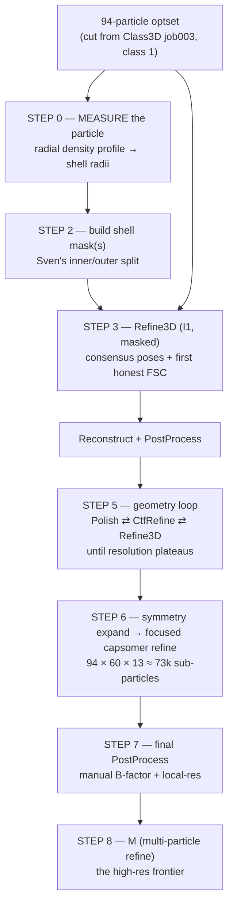

# 412 capsid — STA refinement playbook (aggregation → sub-nanometer)

*The job-by-job sequel to [`412-capsid-aggregation-handoff.md`](412-capsid-aggregation-handoff.md).
That doc got us to **94 clean particles @ 16.3 Å** (Class3D winner). This doc drives them to the
best-resolution average we can get, in RELION-5 tomo + M, and explains **why** at each step so the
arcane parts stop being arcane.*

*Grounded in Sven/Florian's CryoBoost tutorial (the Copia recipe — Copia is 412's sister
retrotransposon capsid, same I1 workflow) and Sven's inner/outer-shell masking guidance.
Refinement runs in **RELION / M**, not crboost — crboost's job was aggregation + the honest
starting model, and that's done.*

> 🤝 **Working agreement — this whole effort is *external* to crboost.** We run it in **RELION / M and
> whatever else helps, straight from Apptainer containers**; we do **not** add code or job types to
> crboost for it. crboost's role ended at aggregation (the 94-particle optset + the honest starting map).
> Artem has spare containers for RELION/M/etc. beyond the ones in `config/conf.yaml` — if a step wants a
> specific build, ask.
>
> **Claude's sandbox has no `/groups` mount, no python, and no container runtime**, so the exact paths,
> `relion_image_handler --stats`, the radii, the RELION version, and the M check are all **yours to run
> and paste back**. On restart the 412 project dir gets bind-mounted — that lets Claude **read the star
> files and cut the 94-particle subset directly**, but *not* run RELION/numpy/apptainer. Bring-up
> commands (full paths) are in **§11**.

> 📓 **RECORD-KEEPING RULE — standing (2026-07-06, Artem).** *Every* job we run from here on — each
> Refine3D, mask, symmetry-expand, capsomer refine, Reconstruct, PostProcess, M — gets logged in
> **`/groups/klumpe/crboost_data/412_aggregation/sta_refine/summary.md`** in the same job-by-job format
> already there: the **verbatim command in a code block** + the **absolute output-map path** + a one-line
> what/why. `summary.md` is the runnable record (paste-into-ChimeraX paths); this playbook is the
> reasoning. Keep them in sync — a job that ran but isn't in `summary.md` doesn't count as done.

---

## 0. The whole arc in one picture



**The mental model in four ideas** (everything below is just these, applied):

1. **Gold-standard FSC keeps you honest.** Refine3D splits your particles into two independent
   half-sets and never lets one see the other. The resolution it reports (FSC = 0.143) is therefore
   *real*, not wishful — unlike Class3D's number, which is alignment-limited and optimistic. This is
   why 16.3 Å from Class3D is a floor, not a verdict.
2. **Low-pass the reference or you'll hallucinate.** Feed a refinement a sharp reference and it will
   "find" that reference in pure noise (*Einstein-from-noise*). Always low-pass the starting map so
   the *data*, not the reference, decides the high-res detail. This is why we use **your** class001
   low-passed — never Sven's high-res template — as the input.
3. **Symmetry is free signal.** An icosahedral capsid carries **60 identical copies** of itself.
   Imposing I1 averages all 60 → your 94 particles punch like ~5,640. Expanding that symmetry later
   (Step 6) lets each copy be refined on its own → the path to sub-nm.
4. **Bin for decisions, unbin for measurement.** (See [`binning-and-resolution.md`](binning-and-resolution.md).)
   Coarse pixels are fine for sorting/rough alignment; the final resolution-defining steps must run
   on fine pixels. We refine at a moderate bin and drop to bin 1 only for the last push.

---

## 1. Inputs & standing conventions

From the handoff — these are fixed for the whole pipeline:

| Thing | Value |
| --- | --- |
| Particles | **94** (Class3D job003, `rlnClassNumber == 1`) |
| Symmetry | **I1** (keep this convention *everywhere* — it's what job002/003 + the boss recipe used) |
| Unbinned box / apix | **600 px @ 1.55 Å/px** (bin 1) |
| Particle diameter | **550 Å** (≈ 355 px at bin 1) |
| Mask diameter (RELION arg) | **575 Å** |
| Current best map | `External/job003/run_it015_class001.mrc` (600 px, 1.55 Å/px, 94 ptcls, 16.3 Å) |
| Refine working box | **bin 1: box 600 @ 1.55 Å** for the first consensus refine — it's the existing extraction, and Class3D (job003) already refined 3 classes there, so it's proven; ref + mask are already 600/1.55 → **no rescale**. Re-extract at **bin 2** (box 384 / 3.1 Å/px) only if the Step-5 loop needs the speed. |
| RELION | **5.0.1** (commit b16a35; confirmed 2026-07-02 via `rel relion_refine --version`). optimisation_set world. |

**Reference discipline (applies to every Refine3D/Class3D below):** input reference = your own map,
**low-passed**; rely on gold-standard FSC; Sven's `try1` template is a *cross-check only*
(`/groups/klumpe/user/sven.klumpe/Processing/412/try1/Class3D/job121/run_it015_class001.mrc`), never a
refinement input.

> ⚙️ **Running tools on this cluster — read before every code block below.** There is **no `module load`**
> here; RELION 5.0-tomo, IMOD, ChimeraX and Warp/M are Apptainer images under `/groups/klumpe/software/…`
> (see `config/conf.yaml → tools:`). Every RELION command in this doc runs *inside* the RELION image.
> Define this once per shell and prepend `rel` to the RELION commands:
>
> ```bash
> RELION5=/groups/klumpe/software/Setup/cryoboost_containers/relion5.0_tomo.sif
> rel() { apptainer exec --nv --cleanenv -B /groups -B /scratch -B /tmp "$RELION5" "$@"; }
> #   headless example:  rel relion_image_handler --i map.mrc --stats
> ```
>
> **The GUI** (the job-by-job Refine3D/Polish/CtfRefine flow) needs a display — drop `--cleanenv` and launch
> it *inside your VNC appliance session* (the same GPU-node setup as the ArtiaX picking viewer):
> ```bash
> apptainer exec --nv -B /groups -B /scratch -B /tmp "$RELION5" relion &   # add --tomo if your build wants the tomo menu
> ```
> RELION's *Running* tab needs a SLURM submit template — reuse crboost's `config/qsub.sh` (its
> `XXXextra1..8XXX` slots already map to Partition/Constraint/Nodes/Tasks/CPUs/GRES/Memory/Walltime).
>
> **EMAN2 is not installed** (no container, no `conf.yaml` tool entry), so the `e2proc3d.py` mask carves
> below are replaced by a small numpy shell-carve run *inside* the RELION image (it ships python + mrcfile)
> → `relion_mask_create` for softening. If Lmod happens to expose one (`module avail eman`), the original
> `e2proc3d` lines are equivalent.

---

## 2. STEP 0 — Measure the particle first *(decides the whole mask design)*

We don't yet know whether 412's interior is **a second ordered protein layer** (e.g. the capsid
protein's C-terminal-domain shell, the classic two-layer retroviral/retrotransposon lattice) or **a
disordered genome/RNA core** (like Copia, where the tutorial simply carves the inside out). That one
fact decides whether we build **two focused targets** or **one shell + an exclusion mask**. So measure
before masking.

### Run these on the cluster

```bash
cd /groups/klumpe/crboost_data/412_aggregation      # your 412 project (holds External/job003/)
MAP=External/job003/run_it015_class001.mrc

# (a) sanity: box, apix, min/max/mean  (confirm apix ≈ 1.55 — if it prints 0, the header is unset)
rel relion_image_handler --i "$MAP" --stats

# (b) radial density profile — the key readout (numpy, headless, no EMAN)
rel python3 - "$MAP" <<'PY'
import sys, numpy as np, mrcfile
with mrcfile.open(sys.argv[1], permissive=True) as m:
    d = np.asarray(m.data, dtype="float32"); apix = float(m.voxel_size.x)
c = np.array(d.shape) // 2                       # RELION box-center convention (even box)
z, y, x = np.indices(d.shape)
r = np.rint(np.sqrt((z-c[0])**2 + (y-c[1])**2 + (x-c[2])**2)).astype(int)
prof = np.bincount(r.ravel(), d.ravel()) / np.maximum(np.bincount(r.ravel()), 1)
print(f"# apix = {apix} A/px   box = {tuple(d.shape)}")
print("# r_px     r_A      mean_density")
for i, v in enumerate(prof):
    print(f"{i:5d} {i*apix:8.1f}  {v: .5f}")
PY
```

Read the three radii off that curve: density rises out of solvent → `R_in`; a *dip* inside the shell →
`R_mid` (two-layer case); density falls back to solvent → `R_out`. Visual cross-check in ChimeraX — launch
it the way your curation appliance does (GPU node + VNC), **not** on the headnode:

```bash
CX=/groups/klumpe/software/containers/sifs/chimerax_artiax_GL.sif
apptainer exec --nv -B /groups "$CX" vglrun -d egl chimerax &
#   in ChimeraX:  open <MAP> ; volume gaussian #1 sDev 2   (light smooth so the shells read cleanly)
```

*(The numpy profile is the source of truth; ChimeraX just lets you eyeball the shells. If `import mrcfile`
ever fails in the RELION image, read the radii off the ChimeraX view instead.)*

Either way, produce a **density-vs-radius curve** and read off (in **pixels at 1.55 Å/px**, then I'll
convert to whatever bin the mask needs):

| Symbol | Meaning | How to spot it |
| --- | --- | --- |
| `‹R_out›` | outer surface of the capsid | density falls to solvent going outward |
| `‹R_mid›` | boundary between outer & inner shells (**if two exist**) | a *dip* between two density peaks inside the shell |
| `‹R_in›`  | inner surface of ordered density | density falls to solvent/flat going inward |
| core | everything inside `‹R_in›` | flat/noisy = disordered genome |

### The decision (this is what your "not sure" answer routes into)

```
 radial profile shows...                         → mask design
 ─────────────────────────────────────────────    ─────────────────────────────────────
 TWO ordered peaks inside the shell               → TWO focused targets:
   (clear dip at R_mid)                              outer mask [R_mid..R_out]
                                                     inner mask [R_in..R_mid]
                                                     (+ full-shell mask [R_in..R_out] for consensus)

 ONE ordered shell + flat/noisy core              → exclusion-only (the Copia case):
   (smooth falloff toward center)                    one shell mask [R_in..R_out], carve core < R_in
```

**Deliverable of Step 0:** the three radii + which branch we're in.

> ✅ **RESULT (2026-07-02) — ONE-SHELL.** Radial profile (box 600 @ 1.55; solvent/mask = 0 beyond
> r≈184 px / 285 Å = the map's built-in ~575 Å-diameter mask):
> - **One dominant *positive* protein shell** — rises out of the lumen (zero-crossing ~125 Å / r≈81 px),
>   peaks **+8.9e-4 at ~183 Å (r≈118 px)**, falls through a ~240–250 Å plateau to a small negative ring
>   (~270 Å) then the mask. This is the capsid protein.
> - **Lumen (r < ~125 Å) is *negative* throughout** (−3e-4 → −8e-4, deepest at centre). A second
>   *ordered* protein layer would read **positive** — it doesn't → the interior is disordered/hollow
>   (genome/RNP), **not** a refinable inner shell.
> - Sub-features — a weak positive outer bump ~220 Å (dip ~204 Å) + a faint interior shoulder ~71 Å —
>   are **≪10 %** of the shell amplitude; **too weak at 16 Å to commit to a two-layer focused refine.**
>   Revisit the inner/outer split (Step 6) only if they sharpen into real peaks after Step 3/5.
>
> **→ Branch = ONE-SHELL.** `R_in ≈ 120 Å` (≈77 px, inner protein surface) · `R_out ≈ 250 Å` (≈161 px,
> outer falloff) · map already masked ~285 Å (184 px). For the *consensus* mask these are diagnostic
> only — the mask is **threshold-only** (lumen is negative → auto-excluded); see the Step-2 FINALIZED
> callout. The radii feed the *focused* inner/outer masks only if we later take the two-layer branch.

> Why this gates everything: the mask is the object that tells cross-correlation *what to align on*.
> Get the radii wrong and you either include disordered core (alignment chases noise) or clip real
> shell density (you throw away signal). This is the single most consequential number-fetch in the
> playbook.

---

## 3. STEP 1 — Cut the 94-particle optset

> ✅ **DONE (2026-07-02, cut directly from the mounted project).** The surgical route below was used:
> `run_it015_data.star` filtered to `rlnClassNumber==1`. Verified — **94 rows, all class-1, all 24
> fields**; the `data_general`/`data_optics`/loop-header blocks are **byte-for-byte identical** to
> RELION's output; the optics row confirms **300 kV · Cs 2.7 · ampl 0.1 · 1.55 Å/px · box 600 · bin 1**
> (so §1's conventions are now runtime-verified, not assumed). The 94 span **57 tilt-series** (max 16 in
> one, most just 1 — see the Step-5 caveat); all 57 are present in `tomograms.star`. Carry forward:
>
> ```
> optimisation_set : /groups/klumpe/crboost_data/412_aggregation/sta_refine/optimisation_set.star
> particles (94)   : /groups/klumpe/crboost_data/412_aggregation/sta_refine/particles.star
> tomograms (shared): /groups/klumpe/crboost_data/412_aggregation/MergedSources/merge-20260626-132413/tomograms.star
> ```
> All paths inside are **absolute** → the subset is relocatable (move `sta_refine/`, or use `$PROJ` as the
> RELION project root — either resolves). External to crboost; nothing in the pipeline references it.

Refine3D refines **every** particle you give it; feed it all 112 and the 18 junk come back. So subset
to class 1 first. Two equivalent routes:

- **RELION Subset selection** job on `External/job003/` → select class 1 → it writes the class-1
  `particles.star` + a matching `optimisation_set.star`. Cleanest, keeps provenance.
- **Surgical star edit** (I can generate this for you): filter `run_it015_data.star` to
  `rlnClassNumber == 1` (94 rows) and rewrite the optimisation_set to point at it.

Output you carry forward: **`optimisation_set.star` → `particles.star` (94 rows)** + the shared
`tomograms.star`.

---

## 4. STEP 2 — Build the shell mask(s) *(Sven's inner/outer step)*

This is the exact mechanic from the tutorial's *Mask creation* — carve the map with a hard radial cut,
then soften with `relion_mask_create`. We just parameterize it with **your** Step-0 radii and, if the
profile shows two layers, make the complementary pair.

> ⚠️ **apix/box gotcha:** a mask must live at the **same box & pixel size as the map it's applied to.**
> Your class map is 600 px @ 1.55; your first refinement runs at bin 2 (224 crop @ 3.1). Either build
> the mask on a map already at the refinement sampling, or `relion_image_handler --rescale`/`--new_box`
> the mask to match. Mismatched masks silently misalign — a classic time sink.

> ✅ **FINALIZED for 412 (2026-07-02) — Step-3 consensus mask is threshold-only, NO carve.** Step 0 came
> back **one-shell** over a *negative* lumen (see §2 Step 0 RESULT). Because the lumen is negative, a
> positive density threshold excludes it on its own — the `carve_shell.py` route below is only needed for
> the Step-6 focused inner/outer split (which we're deferring). Build straight from the class map at its
> native **600 px / 1.55 Å**, which is also the refinement box (§1: we refine at bin 1) → **no rescale**:
>
> ```bash
> MAP=/groups/klumpe/crboost_data/412_aggregation/External/job003/run_it015_class001.mrc
> cd /groups/klumpe/crboost_data/412_aggregation/sta_refine
> rel relion_mask_create --i "$MAP" --o mask_shell.mrc \
>     --lowpass 18 --ini_threshold 0.0005 --extend_inimask 5 --width_soft_edge 7 --angpix 1.55 --j 4
> rel relion_image_handler --i mask_shell.mrc --stats   # mask mean = enclosed fraction; hollow shell ~0.07–0.09
> ```
> `0.0005` is data-driven (radial shell-mean peaks at 8.9e-4). Fills the centre → raise it; broken/patchy
> → lower it. **The `--ini_threshold 0.15` in the template below is an *absolute* value → selects nothing
> on this map (peak ≈ 9e-4). Use the 412 number above, not 0.15.**
>
> ✅ **BUILT 2026-07-02:** `mask_shell.mrc` → `avg 0.0871, min 0, max 1` = clean soft hollow shell,
> green-lit for Refine3D. (Expected ~**0.07–0.09** for a hollow capsid shell `[R_in..R_out]` — *not* the
> 0.10–0.20 of a solid blob; the lumen is excluded. Geometry check: hard shell [120..250 Å] ≈ 0.072 of the
> box, + soft edge → 0.087. So if you rebuild and land in 0.07–0.09 you're right.)

```bash
# EMAN-free radial carve (runs inside the RELION image): keep density in [r_in, r_out] px, zero elsewhere.
# r_out = -1 means "no outer cap" — let relion_mask_create's density threshold set the outer bound.
cat > carve_shell.py <<'PY'
import sys, numpy as np, mrcfile
inp, outp, r_in, r_out = sys.argv[1], sys.argv[2], float(sys.argv[3]), float(sys.argv[4])
with mrcfile.open(inp, permissive=True) as m:
    d = np.asarray(m.data, dtype="float32"); vs = m.voxel_size
c = np.array(d.shape) // 2
z, y, x = np.indices(d.shape)
r = np.sqrt((z-c[0])**2 + (y-c[1])**2 + (x-c[2])**2)
keep = r >= r_in
if r_out > 0: keep &= r <= r_out
with mrcfile.new(outp, overwrite=True) as o:
    o.set_data(np.where(keep, d, 0).astype("float32")); o.voxel_size = vs
PY

# ---- FULL-SHELL mask (consensus Refine3D, Step 3) : carve core < R_in, keep the shell ----
rel python3 carve_shell.py "$MAP" vol4Mask_shell.mrc ‹R_in› -1
rel relion_mask_create --i vol4Mask_shell.mrc --o MaskCreate/shell/mask.mrc \
    --lowpass 18 --ini_threshold 0.15 --extend_inimask 5 --width_soft_edge 7 --angpix <apix>

# ---- OUTER-SHELL mask (focused refine, Step 6) : keep [R_mid..R_out] ----
rel python3 carve_shell.py "$MAP" vol4Mask_outer.mrc ‹R_mid› -1
rel relion_mask_create --i vol4Mask_outer.mrc --o MaskCreate/outer/mask.mrc \
    --lowpass 18 --ini_threshold 0.15 --extend_inimask 5 --width_soft_edge 7 --angpix <apix>

# ---- INNER-SHELL mask (focused refine, Step 6) : keep [R_in..R_mid] — two-layer branch only ----
rel python3 carve_shell.py "$MAP" vol4Mask_inner.mrc ‹R_in› ‹R_mid›
rel relion_mask_create --i vol4Mask_inner.mrc --o MaskCreate/inner/mask.mrc \
    --lowpass 18 --ini_threshold 0.15 --extend_inimask 5 --width_soft_edge 7 --angpix <apix>
```

**Which mask when:**

| Mask | Radii | Used in |
| --- | --- | --- |
| full-shell | carve core `< R_in`, keep to `R_out` | Step 3 consensus Refine3D, all of Step 5 |
| outer-shell | `[R_mid .. R_out]` | Step 6 focused refine (outer target) |
| inner-shell | `[R_in .. R_mid]` | Step 6 focused refine (inner target) *(two-layer branch only)* |

**Why two focused masks (the biology):** in a two-layer CA lattice the outer and inner domains flex
relative to each other. One mask over both lets the stronger layer drag the alignment and smear the
other. Masking each layer alone makes cross-correlation "see" only that layer → each refines to its own
best pose. That's Sven's "so the alignment doesn't get confused by the other parts," verbatim.

---

## 5. STEP 3 — Consensus Refine3D (I1, masked)

First gold-standard refinement: honest FSC + poses good enough to feed the geometry loop.

```text
Input optimisation_set : sta_refine/optimisation_set.star           (94 ptcls, Step 1)
Reference map          : External/job003/run_it015_class001.mrc      (your winner, 600 px @ 1.55)
Reference mask         : sta_refine/mask_shell.mrc                   (one-shell, Step 2)
Symmetry               : I1
Box / bin              : 600 px @ 1.55 Å (bin 1 — the existing extraction; no re-extract, no rescale)
Initial low-pass       : 40 Å           (filter the reference hard — anti-Einstein-from-noise at N=94; Class3D used 45)
Angular search         : global auto-refine from 3.7°   (94 ptcls makes global cheap + robust; Class3D poses just seed it)
Mask diameter          : 575
Solvent-flattened FSC  : Yes
Reference on absolute greyscale : Yes
Pre-read particles into RAM / GPU : Yes / Yes   (~5–6 GB; drop GPU pre-read to No if it OOMs on gpu:1)
Submit to queue        : Yes
```

**Local vs global — pick one:**

- **Local (recommended, matches the tutorial):** you already have converged I1 poses from Class3D, so
  polish them. `Initial low-pass 16–20 Å · initial angular sampling 1.8° · offset range 2 · local
  searches 1.8°`. Faster, lower bias risk.
- **Global (your original plan):** if you distrust the Class3D poses, start wide. `Initial low-pass
  30–40 Å · sampling 3.7° global`. Safer against wrong poses, slower. Gold-standard FSC protects you
  either way.

> ▶ **HEADLESS CLI — no GUI (FINALIZED 2026-07-02).** The card above is reproduced by
> `sta_refine/run_refine3d.sh` (written + ready to `sbatch`). The key tomo flag — mined from the real
> command in `External/job003/run.out` that produced the 16.3 Å map — is **`--ios <optimisation_set.star>`**
> (NOT `--i`); that's how the optimisation set (particles + tomograms + trajectories) is passed. The script
> is the known-good Class3D invocation minus `--K/--iter/--firstiter_cc`, plus
> `--auto_refine --split_random_halves --low_resol_join_halves 40` and `--solvent_mask mask_shell.mrc
> --solvent_correct_fsc`.
>
> ⚠️ **MPI IS MANDATORY for gold-standard auto-refine** (learned the hard way 2026-07-02). The **serial**
> `relion_refine` aborts in ~1 min with `ERROR: Cannot split data into random halves without using MPI!`.
> Class3D ran serial only because *classification never splits half-sets* — auto-refine does. So the job
> uses **`mpirun -np 3 relion_refine_mpi`** (1 leader + 1 worker per half-set; the 3 ranks share the 1 GPU),
> launched *inside* the container (`apptainer exec … bash -lc "mpirun -np 3 relion_refine_mpi …"`), with
> `#SBATCH --ntasks=3 --cpus-per-task=4`. If the image lacks its own `mpirun`, fall back to host-launched
> `srun --mpi=pmix apptainer exec … relion_refine_mpi …`. Submit: `sbatch sta_refine/run_refine3d.sh`;
> watch `sta_refine/refine3d-*.out`; grep `Final resolution` for the FSC number.

**Then, immediately:** *Reconstruct particle* (I1, box 384 / crop 224) → *PostProcess* (reference
mask = full-shell). That PostProcess FSC is your **first real resolution number** — the baseline every
later step must beat.

---

## 6. STEP 5 — The geometry refinement loop *(the big tomo lever)*

This is what "iterate Refine3D with per-tilt CTF + frame/tilt alignment" actually is: a **fixed job
graph**, run in this order, looped. It's the tutorial's job019→029 chain.

```
Refine3D → Reconstruct → PostProcess
        → Polish  (frame + per-particle motion)  → Extract → Reconstruct → PostProcess
        → CtfRefine (per-tilt defocus; later aberrations) → Extract → Reconstruct → PostProcess
        → (back to Refine3D)   ⟲ repeat until the FSC stops moving
```

**Polish first, then CtfRefine** (tutorial order). Reference params:

| Job | Key params (from tutorial, adjust to 412) |
| --- | --- |
| **Polish** | box 256 · max position error 7 · **Fit per-particle motion: Yes** · `--it 30000` |
| **CtfRefine** | box 256 · defocus search range 6000 · defocus reg. λ 0.2 · (enable astigmatism/higher-order aberrations once resolution warrants) |
| **Reconstruct** | I1 · box 384 · crop 224 |
| **PostProcess** | reference mask = full-shell |

> ⚠️ **94 particles is thin here — and thinner than it looks.** The cut (Step 1) shows the 94 spread
> across **57 tilt-series, ~1.6 particles each** (only one series has 16; most have a single particle).
> Polish/CtfRefine fit geometry *per physical particle / per tilt-series* — and unlike averaging,
> **symmetry does not multiply your leverage** for these fits. With ~1–2 particles per series even the
> normally-robust **per-tilt defocus (CtfRefine) is weakly constrained**, and **per-particle motion
> (Polish) will be noisy or unfittable**. Practical order: try CtfRefine (defocus only, strong λ) first;
> if a Polish round makes the FSC *worse*, drop it. Watch for divergence; don't loop past the plateau
> (overfitting eats small datasets). This sparse-per-series geometry is also why **M (Step 8) — which
> co-refines all species in a series jointly — may not beat consensus Refine3D much until there are more
> particles per tilt-series.**

When the FSC plateaus, this consensus map is as far as vanilla whole-capsid refinement goes. The
remaining gains come from Step 6.

---

## 7. STEP 6 — Symmetry expansion → focused capsomer refinement *(the sub-nm win)*

This is the capsid-specific move and Sven's `94 × 60 × 13 ≈ 73k` arithmetic.

**What it does, conceptually:**

1. **Expand** the symmetry (`relion_particle_symmetry_expand --sym I1`): each of the 94 particles is
   written out as **60 oriented copies**, one per icosahedral asymmetric unit → 5,640 entries.
2. **Re-center on a capsomer.** Shift each copy's origin from the capsid center to a single capsomer
   (pentamer/hexamer) position, and **re-extract that sub-volume** as its own small particle. With ~13
   capsomers per asymmetric unit that's the ~73k sub-particles.
3. **Locally refine** the sub-particles with a **capsomer-sized mask** and the capsomer's **own local
   symmetry** (C5 at a pentamer, C6 at a hexamer). Small box, huge N, local searches → highest local
   resolution.

**The inner/outer split lands here most powerfully:** run the focused refinement **twice** —
`Reference mask = outer-shell` and `= inner-shell` — producing a clean map per layer.

> **Caveats worth stating up front (never fail silently):**
> - The **centering + I1 convention must be verified** before expansion; a wrong center symmetrizes to
>   mush. Confirm the map sits on the icosahedral origin (a quick I1-symmetrized vs unsymmetrized
>   overlay in ChimeraX is enough).
> - Sub-particle re-extraction/re-centering for **subtomograms** is fiddlier than for SPA and its exact
>   flow depends on your RELION-5 build. **DECIDED (2026-07-02): route Step 6 through M, not RELION 5.0.1.**
>   5.0.1's subtomo re-extraction at shifted centres is not a clean one-job flow, and **M is confirmed
>   present** (§9) and does capsomer localization natively (define the capsomer as a species) — so Step 8
>   absorbs Step 6: expand + re-centre + focused-refine all happen inside M.

---

## 8. STEP 7 — Final PostProcess + local resolution

```text
PostProcess : unfiltered half-maps from the last Reconstruct
              reference mask = the tight, honest mask (shell or capsomer)
              Estimate B-factor automatically : No          ← auto over-sharpens small sets
              Provide your own B-factor        : start ‹−75› (tutorial value; tune per FSC)
LocalRes    : per-voxel resolution map — tells you which parts earned their detail
```

The manual B-factor is not optional at N≈94: RELION's automatic B-factor is fit on the high-res FSC
tail, which is unstable with few particles and will over-sharpen. Set it by hand and sanity-check the
map isn't growing noise spikes.

---

## 9. STEP 8 — M (multi-particle refinement) — the frontier

You already live in WarpTools, so **M** is the natural high-res finisher. It jointly refines
per-particle poses, per-tilt CTF, and tilt-series geometry **against the map** in one optimization —
usually the biggest single jump past vanilla Refine3D, and the clean home for the **per-capsomer
species** (it does Step 6's localized reconstruction as a first-class feature). Push the Step-6/7 poses
into M, define the capsid (and each shell/capsomer) as species, and let it co-refine.

> ⚙️ **Reaching M on this cluster — ✅ CONFIRMED (2026-07-02).** The Warp image ships the M CLI:
> `MTools`, `MCore`, `WarpTools` all resolve under `/opt/conda/envs/warp/bin/` (bare `M` is the GUI, not
> needed — headless M runs via MTools/MCore). Image:
> `/groups/klumpe/software/Setup/cryoboost_containers/warp_2.0.0dev36_aretomo1.0.0_cuda11.8_glibc2.31.sif`.
> The non-trivial part is the *handoff*, not the install: M consumes Warp's population/species format, so
> the Step-6/7 RELION poses (`optimisation_set.star` → `particles.star`) must be converted back into a
> Warp/M project. Give me your RELION-5 point release + whether the 412 data still has its original Warp
> processing directory and I'll write the exact `WarpTools`/`MTools` handoff.

---

## 10. Checklist, red flags & expectations

**Do-in-order checklist**

- [ ] Step 0 radial profile → `R_in / R_mid / R_out` + one/two-layer decision *(gated on you — needs numpy/MRC)*
- [x] **Step 1 cut 94-particle optset — DONE** → `sta_refine/{optimisation_set,particles}.star` (94 rows, verified)
- [ ] Step 2 build mask(s) **at the refinement box/apix**
- [ ] Step 3 consensus Refine3D → first honest FSC (beat 16.3 Å)
- [ ] Step 5 geometry loop until plateau (CtfRefine reliable; Polish only if it helps)
- [ ] Verify center/convention → Step 6 symmetry-expand + focused (outer, and inner if two-layer)
- [ ] Step 7 manual B-factor + local-res
- [ ] Step 8 M for the frontier

**Red flags → what they mean**

| Symptom | Likely cause | Fix |
| --- | --- | --- |
| FSC "improves" but map = your reference | Einstein-from-noise (reference too sharp) | low-pass the reference harder; trust gold-standard FSC only |
| Symmetrized map is mush | off-center / wrong I-convention | re-center before expansion; confirm I1 axis |
| Refinement drifts/worsens | 94 particles overfitting | fewer iterations, wider mask, drop Polish |
| One shell smears the other | single mask over both layers | the inner/outer split (Step 2/6) |
| Map clipped at edges | mask apix ≠ map apix | rescale the mask to the working box |

**Resolution expectations (honest):** 16.3 Å now is alignment-limited. Consensus Refine3D + geometry
loop should get you into the ~8–12 Å band (Copia hit 7.5–8.5 Å on this exact recipe). The focused
capsomer step + M is where sub-nm becomes plausible — but the **hard floor is 94 particles**; more real
picks is the only way to raise it. Data Nyquist is 3.1 Å at bin 2, so the ceiling isn't the limiter yet.

---

## 11. Session bring-up — mount this, gather these

**On restart, bind-mount the 412 project into Claude's sandbox** (confirm the dir name with the `ls`
below and fix if it differs):

```
/groups/klumpe/crboost_data/412_aggregation
```

- **What the mount unlocks for Claude:** reading the RELION `.star` files as text → **cutting the
  94-particle `particles.star` + `optimisation_set.star` for you** (Step 1), plus confirming exact
  filenames so no command below carries a guessed path.
- **What it still can't do:** run RELION, numpy, or apptainer — the sandbox has no python interpreter
  and no container runtime. `--stats`, the radial profile, the RELION version, and the M check are
  **yours to run and paste back** (MRC is binary; without numpy Claude can't compute the profile).

**Gather-and-paste checklist** — full paths; `rel` is the alias from §1:

```bash
PROJ=/groups/klumpe/crboost_data/412_aggregation           # ← confirm/fix this first (step 0 below)
RELION5=/groups/klumpe/software/Setup/cryoboost_containers/relion5.0_tomo.sif
WARP=/groups/klumpe/software/Setup/cryoboost_containers/warp_2.0.0dev36_aretomo1.0.0_cuda11.8_glibc2.31.sif
rel() { apptainer exec --nv --cleanenv -B /groups -B /scratch -B /tmp "$RELION5" "$@"; }

# 0. confirm the project + that the winner map & its data star live where we think
ls -la "$PROJ"/External/job003/

# 1. box / apix / greyscale of the starting map  → confirms 600 px @ 1.55 Å
rel relion_image_handler --i "$PROJ/External/job003/run_it015_class001.mrc" --stats

# 2. radial density profile  → the three radii (paste the whole table)
#    run the numpy snippet from §2 STEP 0 with:
#      MAP="$PROJ/External/job003/run_it015_class001.mrc"

# 3. exact RELION point release  → pins the Step-6 sub-particle re-extraction flow
rel relion_refine --version

# 4. is M actually inside the Warp image?  → decides whether Step 8 uses this container
apptainer exec --nv "$WARP" bash -lc 'command -v MTools MCore M WarpTools'
```

**The three blockers that finalize this doc:**

1. ~~**The three radii** + branch~~ → ✅ **ONE-SHELL, R_in≈120 Å / R_out≈250 Å** (§2 Step 0 RESULT); consensus mask is threshold-only (§2 Step 2 FINALIZED).
2. ~~**RELION point release**~~ → ✅ **5.0.1** → Step 6 routed **through M** (§7), which is ✅ present (§9).
3. ~~**The 94-particle cut**~~ — ✅ **DONE 2026-07-02.** Written to
   `/groups/klumpe/crboost_data/412_aggregation/sta_refine/{optimisation_set,particles}.star`
   (94 class-1 rows, headers byte-identical, 57 tilt-series all present in `tomograms.star`). See §3.

**Containers:** the paths above are the ones crboost uses (`config/conf.yaml`). If you have a cleaner or
newer **M** / **RELION 5** build lying around, point me at it — the Warp image is a `dev36` build and its
M may lag a release; I'll target whatever you give me.

---

## 12. Why only 35.8 Å? — verification roadmap (opened 2026-07-03)

> 🚩 **HANDOFF — START HERE NEXT SESSION.** The first clean gold-standard Refine3D (SLURM job 98819, solo on an
> A100) **capped at 35.8 Å** — far worse than Class3D's 16.3 Å. Evidence: per-particle alignment accuracy is
> *good* (1.17°, ≈ Class3D's 1.00°) but the two independent half-sets **only agree to ~35 Å** — gold-standard
> FSC ≈1.0 down to 38 Å, then a **cliff to 0.03 at 34 Å**, dead past 22 Å. So Class3D's 16.3 was **optimistic /
> overfit** (its number = single-map SSNR, which counts overfit noise as signal); 35.8 is the honest number.
> **We are NOT accepting 35 Å as the floor** — the refine setup below was authored by Claude and *never
> independently verified by Artem*, so "the approach is faulty" is a first-class hypothesis. This section is the
> ruled-out ledger + the exact commands + the ordered tests. **Work Tier 0 → 1 → 2 in order; stop when a test
> moves the resolution.** Everything runs external, headless, in the RELION-5.0.1 Apptainer image (see §1/§5).

### 12.0 Already RULED OUT — metadata audit (2026-07-03, from `MergedSources/…/tomograms.star`, all 125 tomos)

| Parameter | Across all 8 source datasets | Verdict |
| --- | --- | --- |
| `rlnTomoHand` (handedness) | **−1 for every tomo** | ✅ not mixed |
| `rlnMicrographOriginalPixelSize` | **1.55 for every tomo** | ✅ not mixed |
| `rlnTomoTiltSeriesPixelSize` | **1.55 for every tomo** | ✅ not mixed |
| Voltage / Cs | 300 kV / 2.7 mm everywhere | ✅ not mixed |
| merged `particles.star` optics | **single** optics group @ 1.55, box 600, bin 1 | consistent |

→ **"datasets differ / mixed handedness / mixed binning" is RULED OUT.** ⚠️ One caveat: the merge collapsed all
sources into ONE optics group, so a per-source apix difference would be *invisible in particles.star* — but the
per-tomo `tomograms.star` (where it WOULD survive) is uniform, so this is solid. (Separate, non-cap question: is
`HAND=−1` the *correct absolute* hand for 412? See [[project_412_tomohand_discrepancy]]. Irrelevant to the
gold-standard cap, which only needs internal consistency — and that holds.)

### 12.1 The EXACT commands that produced 35.8 Å (audit every value)

**Mask** → `sta_refine/mask_shell.mrc` (built by Claude; `relion_image_handler --stats` = avg 0.0871 = hollow shell):
```bash
relion_mask_create --i External/job003/run_it015_class001.mrc --o sta_refine/mask_shell.mrc \
  --lowpass 18 --ini_threshold 0.0005 --extend_inimask 5 --width_soft_edge 7 --angpix 1.55 --j 4
```

**Refine** → `sta_refine/run_refine3d.sh`  (SBATCH: `-p g -C g2|g4 -N1 -n3 -c4 --gres=gpu:2 --mem=128G -t8:00:00`;
launched as `apptainer exec --nv --cleanenv -B /groups -B /scratch -B /tmp "$RELION5" bash -lc "mpirun -np 3 …"`):
```bash
relion_refine_mpi \
  --ios  sta_refine/optimisation_set.star \       # 94 class-1 ptcls, box 600 @ 1.55 Å, bin 1
  --ref  External/job003/run_it015_class001.mrc \ # ⚠️ Class3D winner — never verified as a good / on-axis I1 model
  --o    sta_refine/Refine3D/run \
  --auto_refine --split_random_halves \           # gold-standard (mandatory: serial binary refuses this, see §5)
  --low_resol_join_halves 40 \                     # ⚠️ SUSPECT: forces halves identical <40 Å; independent band was only 38→35
  --sym I1 \                                       # ⚠️ SUSPECT: reference never verified to sit on the icosahedral axis
  --particle_diameter 550 \
  --solvent_mask sta_refine/mask_shell.mrc \       # ⚠️ SUSPECT: mask Claude built, never overlaid on the density to check fit
  --flatten_solvent --solvent_correct_fsc \        # ⚠️ SUSPECT: a bad mask here SUPPRESSES the corrected FSC
  --zero_mask \
  --ini_high 40 \                                  # ⚠️ SUSPECT: the FSC cliff sits right at ~38-40 Å = this low-pass
  --healpix_order 2 --auto_local_healpix_order 4 --offset_range 5 --offset_step 2 --oversampling 1 \
  --ctf --norm --scale --pad 2 --trust_ref_size --tau2_fudge 1 \
  --dont_combine_weights_via_disc --pool 30 --j 4 --preread_images --gpu
```
Dropped vs the Class3D that reported 16.3 (job003): `--K 3 --iter 15 --firstiter_cc`. ⚠️ dropping `--firstiter_cc`
assumes the ref is on absolute greyscale — **unverified**. Outcome: **gold-std 35.8 Å · accuracy 1.17° · FSC cliff
38→34 Å · then OOM at the final half-combine → no `run_class001.mrc`.**

### 12.2 The ordered tests (cheapest + most-suspect first; keep every `--o` UNIQUE — never 2 jobs to one dir)

**Tier 0 — eyeball the inputs (ChimeraX in VNC, ~20 min; catches gross errors before burning compute)**
- [ ] Open `run_it015_class001.mrc` (the reference): recognizable icosahedral capsid shell, or already a blob?
- [ ] Overlay `mask_shell.mrc` on it: does the soft shell sit **on** the protein density (not offset / not inverted)?
- [ ] Complete the map (§12.3) and open `Refine3D/run_class001.mrc`: capsid shell → data-limited; garble → setup bug.

**Tier 1 — is it MY setup? one-variable diagnostic refines (≤8 h each on 1 A100). Baseline = §12.1.**
- [ ] **1a — maskless:** drop `--solvent_mask` + `--solvent_correct_fsc` (keep `--zero_mask`). Res jumps → the mask capped it.
- [ ] **1b — release the low-pass:** drop `--low_resol_join_halves 40`; set `--ini_high 25`. Climbs past 35 → my filter/join flags capped it (the FSC cliff at ~38-40 Å is the tell).
- [ ] **1c — greyscale:** add `--firstiter_cc` back. Moves → greyscale was off.
- [ ] **1d — I1 axis:** `relion_align_symmetry --i ref --sym I1 --o ref_onI1.mrc` (+ ChimeraX overlay). If ref isn't on-axis, imposing I1 smears it. (A C1 refine is confounded by 60× lower SNR — prefer the on-axis check.)

**Tier 2 — is it the PARTICLES?**
- [ ] **2a — CTF sanity:** defocus values in the data.star sane (µm range, not 0/garbage)?
- [ ] **2b — per-source subset:** refine the biggest single source alone (e.g. 29× `FCIso_unmilled2` or 20× `SK_20251017` tomos). Single clean source ALSO ~35 Å → not the aggregation; better → aggregation mixing beyond metadata.
- [ ] **2c — ground truth:** what did **Sven's try1** reach on comparable 412 particles? (`/groups/klumpe/user/sven.klumpe/Processing/412/try1/…` — NOT in Claude's mount; Artem checks.) Sven ≪ 35 Å at similar N → our data/extraction differs.
- [ ] **2d — subtomos:** are the box-600 2D-stacks actually centred on particles? spot-check; ties to [[project_412_picking_quantification]].

**Tier 3 — only if Tiers 0-2 are all clean:** 35 Å is the honest 94-particle floor → the lever is *more real picks*, not refinement.

### 12.3 Complete the current map (dodge the final-combine OOM)
```bash
# resume from the converged iteration inside the same `mpirun -np 3 … relion_refine_mpi` wrapper + SBATCH.
# --pad 1 cuts the full-data reconstruction memory ~8× (the combine is the peak-memory step).
relion_refine_mpi --continue sta_refine/Refine3D/run_it017_optimiser.star \
  --o sta_refine/Refine3D/run --pad 1 --j 4 --preread_images --gpu
# alternative: keep --pad 2, bump SBATCH --mem 192G (only g4/A100 nodes have that much).
```

### 12.4 Verification ledger (fill as tests land)
| Test | Hypothesis | Result | Verdict |
| --- | --- | --- | --- |
| metadata audit | sources differ (hand/apix) | uniform −1 / 1.55 | ✅ ruled out (12.0) |
| ref/mask geometry | mask apix≠map / offset / inverted | both **600³, apix 1.55, ORIGIN 0**; mask mean **0.087** = hollow shell (`od` on MRC headers) | ✅ ruled out — geometry lines up |
| refine sampling | 6.2-vs-1.55 pixel confusion | model.star `_rlnPixelSize 1.55`; the 6.2 in particles col-10 = picking-tomo bin (4×1.55), unused | ✅ benign red herring |
| res trajectory | real signal would climb | froze at **35.77 Å from it2**, 15 iters unchanged; `_rlnCurrentImageSize 202` = searched to ~9 Å | ✅ data-limited, not a box/cap |
| 1b · no-join / low-pass caps | join/ini_high cap FSC | FSC ≈1 to 40 Å then a one-shell cliff (0.88→0.03) **at the `low_resol_join_halves 40` boundary** → join *inflates* low-res | ✅ **contradicted — won't help** |
| particle noise (it017) | picks contaminate | **8/94 NrSig>1000 & MaxProb≈0**; 15/94 LCC<0.07; meanMaxProb 0.30; halves 50/44 | ⚠️ **leading cause** |
| 0 · eyeball ref/mask/map (visual) | gross setup error | geometry ✅; map not yet opened | ⬜ do after §12.3 completes it |
| 1a · maskless | mask caps FSC | mask geom verified; `solvent_correct_fsc` protects, not suppresses | ↓ low-prob (skip unless 0 fails) |
| 1c · firstiter_cc | greyscale | norm/scale on; ref DMEAN 4e-5 | ↓ low-prob |
| 1d · I1 on-axis | wrong symmetry | ref is the `--sym I1` Class3D output → on-axis **by construction** | ↓ low-prob (20-min eyeball only) |
| 2b · single-source refine | aggregation mixing | — | ⬜ (next real lever) |
| 2c · Sven try1 compare | data/extraction differs | — | ⬜ (Artem checks) |

### 12.5 — File-evidence verdict (2026-07-06, from run 98819's own star files; **no new GPU run**)

Read the converged run (it017) directly. **The setup is sound; 35.8 Å is the honest, particle-limited floor —
the §12.2 Tier-1 flag sweep will not break it.** This short-circuits to Tier 3 via evidence, not compute.

**Setup lines up (verified correct):**
- **Reference & mask are geometrically identical** — both `600³`, MODE 2, `CELLA 930 Å ⇒ apix 1.55`,
  `ORIGIN 0,0,0` (parsed from the MRC headers with `od`); mask mean **0.0871** = correct hollow shell.
  → "mask apix≠map" / "mask offset or inverted" **ruled out from the headers**, no ChimeraX needed.
- Refine operated at **apix 1.55** (`run_it017_half1_model.star _rlnPixelSize`). The `6.2` in `particles.star`
  col-10 is the *picking-tomo* bin (4×1.55), not the refine sampling → benign.
- Reference sits on the RELION I1 axis **by construction** (it is the `--sym I1` Class3D job003 output).

**Why 35.8 is real, not a flag artifact:**
- **Resolution froze at 35.77 Å from iteration 2** and never moved for 15 iterations (it1 38.75 → it2 35.77 →
  … → it17 35.77). A refine with real high-res signal climbs; this hit a wall immediately.
- **`_rlnCurrentImageSize 202`** ⇒ RELION computed FSC out to ~9 Å and found nothing reproducible past 35 Å.
- **Gold-FSC shape indicts the data, not the flags:** ≈0.99 to ~40 Å, 0.88 @ 35.8, then a one-shell cliff to
  **0.03 @ 34.4** right at the `--low_resol_join_halves 40` boundary, then noisy 0.18–0.56 (never a sustained
  band). The join *inflates* the low-res FSC — dropping it (Tier 1b) makes the number equal-or-worse.

**What actually caps it — N=94 is contaminated:**
- it017's OWN assignments: **8/94 particles NrSig>1000, MaxProb≈0.000** (top three NrSig 12836/12191/8310) =
  no determined orientation, pure noise into a half-set. 15/94 at noise-band CC (LCC<0.07); mean LCC 0.118;
  **mean MaxProb 0.30**. **Half-set imbalance 50/44** with 6 of the 8 noise particles in half1 → halves not
  statistically equivalent, which itself depresses the gold-FSC at this N.

**Levers, in order:** (1) **complete + visually confirm the map** (§12.3; near-free — we've never seen it);
(2) **cull the pure-noise particles + re-refine** (cheap; *modest* expected gain — noise particles mostly add
DC blur, so don't over-promise); (3) the real lever is **more/cleaner picks** (Tier 3), consistent with
[[project_412_picking_quantification]]'s ~8× FP rate. §12.2 Tier-1 (1a/1b/1c) is **de-prioritized**.

### 12.6 — RETRACTION + reframe: there IS a systematic high-res bug (2026-07-06, Artem steered)

**§12.5's "35.8 = honest particle-limited floor" is RETRACTED.** Hard counterexample from Artem: **the boss
(Sven) reached ~3× better resolution on a SMALLER 412 set.** So 94 particles is nowhere near the ceiling — a
systematic high-res killer is in OUR chain. The particle "noise" in §12.5 is most likely a *symptom* (a wrong
reference / CTF / tilt-geometry makes good particles unalignable), not the cause.

**Same-project control (strong).** Our OWN Class3D (job003) reached 16.3 Å on the **same 94 ptcls + same
tomograms**; Refine3D only agrees to 36. Command diff (`job003/run.out` vs `run_refine3d.sh`):

| | Class3D job003 (16.3) | Refine3D (35.8) |
| --- | --- | --- |
| ref | `job002/merged.mrc` | `job003/run_it015_class001.mrc` (lp 40) |
| sampling | `--healpix_order 3` (1.8°) fixed, from good poses | `--healpix_order 2` (**3.7° GLOBAL**) + auto_local 4 |
| mask | none (spherical) | shell mask + `--solvent_correct_fsc` |
| greyscale | `--firstiter_cc` | dropped |
| FSC | single-map SSNR (optimistic) | gold-standard split (honest) |

**Ruled OK from files (this session):** box/apix/origin geometry (§12.5); per-tilt CTF present, sane defocus
(~4.4 µm mean); `rlnTomoHand −1` uniform; per-tilt tomo geometry **self-consistent** — `TomoYTilt = −nominal − 8°`
*exactly* (clean sign convention + constant 8° offset on every tilt → NOT a per-image scramble), refined per-tilt
shifts present (one tilt at 0,0 ref).

**Ranked suspects for the systematic cap (the live hunt):**
1. **Tilt-series alignment / 3D-CTF fidelity (tomo-preprocessing) — top suspect for a 3× gap, NOT checkable from
   these files.** Per-tilt tilt ANGLES are *exactly* `−nominal−8` with **zero per-tilt residual**, offset a
   suspiciously round 8.00° → was a real per-tilt tilt-series alignment ever done, or just nominal+offset+shifts?
   Plus **defocus handedness** (Warp `ts_defocus_hand`) — a classic tomo res-killer, invisible in the star
   ([[project_412_tomohand_discrepancy]], [[project_warp_ts_import_filter]]). **Check Warp/AreTomo align logs;
   diff vs Sven's per-tilt geometry.**
2. **Auto-refine GLOBAL on 47+47 noisy half-sets → halves diverge.** `run_refine3d` used 3.7° global + `ini_high
   40`, discarding the good Class3D poses; §5 recommended LOCAL. *Weakened by:* final accuracy 1.17° = it DID
   reach fine local sampling → poses are fine but maps still disagree past 36, which points more at data/CTF than
   at sampling. **Test: local refine — `--ini_high 20`, no global, tight local, seed Class3D poses.**
3. **Mask + `--solvent_correct_fsc` misfiring.** Corrected-FSC shape (0.88 → one-shell 0.03 @ 34 Å → bounce 0.56
   → oscillate 0.2–0.5) is the signature of a phase-randomization correction going wrong. **Test: maskless (drop
   `--solvent_mask` + `--solvent_correct_fsc`, keep `--zero_mask`).**
4. **Reference sanity (Tier 0):** eyeball `run_it015_class001.mrc` — real on-axis I1 shell or a blob?

**Decisive move:** get Sven's `try1` (`particles.star` / `tomograms.star` / refine command) — NOT mounted in
Claude's sandbox → Artem mounts or pastes. Diffing the *working* 412 pipeline against ours is the fastest route.
Order once the map is completed & eyeballed: maskless (#3) ∥ local (#2) → tomo-geometry / Sven diff (#1).

### 12.7 — Sven try1 diff: ~35 Å is the SHARED 412 consensus ceiling, NOT our bug (2026-07-06, try1 mounted)

Diffed try1 directly. **Sven's converged gold-standard 412 consensus caps at the same wall we hit.**

| | Ours | Sven try1 (best consensus, job135) |
| --- | --- | --- |
| converged gold-std | **35.77 Å** | **34.72 Å** (his global best across all jobs = 31.56 Å) |
| particles | 94 | **23** |
| box / apix | 600 / 1.55 | 448 / 1.55 |
| `--ini_high` | 40 | **15** |
| `--firstiter_cc` | dropped | **kept** |
| `--healpix_order` | 2 (3.7° global) | **3** (1.8°) |
| `--solvent_correct_fsc` | yes | **no** |
| `--low_resol_join_halves` / `--sym` | 40 / I1 | 40 / I1 |

**Both converge to ~32–38 Å despite opposite flag choices, different boxes, and 4× different particle counts →
the §12.6 refine-flag suspects (#2 global search, #3 mask/`solvent_correct_fsc`) are RULED OUT: Sven varies
exactly those and hits the same wall.** 35 Å is the reproducible 412 consensus I1 gold-standard ceiling.

**The "Sven got 15 Å" red herring, killed:** 15.10 Å is `run_it001` ONLY = his `--ini_high 15` initial low-pass
(box-448 FSC shell nearest 15 Å). His trajectory: it1 **15.10** → it2 **36.55** (gold-standard split engages) →
converged **34.72**. Same shape as ours (it1 38.75 from `--ini_high 40` → converged 35.77). The RELION GUI shows
that it1 low-pass as "current resolution" early in a run — the most likely origin of the "boss got ~2–3× better"
impression.

**Sven has NO PostProcess / symmetry-expand / focused-capsomer / M in try1** — his best 412 result *is* the
consensus refine at ~35 Å. Nobody has broken past consensus here.

**Reconciled conclusion:** Artem's "we're not near the ceiling" is RIGHT — but the lever is NOT debugging the
consensus refine (it already matches Sven's). 412 is heterogeneous/flexible; whole-capsid consensus I1 averaging
blends variable capsomer geometry and plateaus ~35 Å for everyone. The sub-nm win is the **focused step:
symmetry-expand → re-center on a capsomer → focused local refine (C5/C6) → M** (playbook §6–8; Copia hit
7.5–8.5 Å via exactly this). **Open:** if a real ~12 Å 412 map exists it is NOT in try1 (best converged 31.56 Å)
→ which try/job/map? That recipe is what we'd replicate.

### 12.8 — Copia (try2) diff: the 3× is REAL but it's a SAMPLE gap, not a pipeline bug (2026-07-06)

Copia = 412's sister capsid, same lab / workflow / RELION. Mounted try2, diffed.

| | 412 (ours) | 412 (Sven try1) | **Copia (Sven try2)** |
| --- | --- | --- | --- |
| best consensus Refine3D | 35.8 Å | 34.7 Å | **10.06 Å** (job054) |
| particles | 94 | 23 | **76** (range 76–124) |
| box / apix / sym | 600 / 1.55 / I1 | 448 / 1.55 / I1 | 448 / 1.55 / I1 |
| geometry loop (Polish+CtfRefine) | none | none | **yes** |
| PostProcess final | none | none | **8.79 Å** |

→ **Particle COUNT is NOT the gap** (Copia 76 → 10 Å; ours 94 → 35). Same workflow/box/sym. The "3× better on a
smaller set" the user remembered = **Copia (~9 Å) vs 412 (~35 Å) — a different, more regular sample.**

**Geometry diff (Artem asked) — RULED OUT.** Per-tilt refined tilt angle vs nominal, all three projects:
`refinedYTilt = −nominal + C` *exactly* (C = −8 ours, +15 Sven-412, +9 Copia = a per-tomogram stage/axis offset).
Identical Warp→RELION convention everywhere; the sign-flip + constant offset is standard bookkeeping, not a
scramble. **Our tilt geometry is fine** (residuals live in the refined shifts, same as Sven/Copia).

**Why 412 caps ~3.5× worse than Copia, for everyone:** not flags (Sven varies them, same wall), not geometry
(identical), not count (Copia 76 → 10). Two live causes:
- **NOT particle quality (CC RETRACTION 2026-07-06).** Head-to-head LCCmax: **ours median 0.117 = Copia 0.117**,
  and BETTER than Sven's own 412 set (0.098). Copia hits 10 Å with the SAME CC we have; Sven hits 35 Å with
  WORSE CC. CC does NOT predict resolution → "our picks are noise" is WRONG (the NrSig/MaxProb I cited came from
  the 35 Å refine itself = circular). Sven's `job121` (K=1, 23 ptcl) is drawn from the SAME `FCIsolation`
  tilt-series we use and also lands ~35 Å ⇒ **35 Å is intrinsic to the 412 sample/data, not our picks.**
- **(C) a CryoBoost/412-COMMON processing issue** — ⚠️ NOT ruled out by "Sven also gets 35": he uses the SAME
  pipeline and shares tomograms. Prime candidate = defocus handedness / CTF ([[project_412_tomohand_discrepancy]],
  [[project_412_divergence_cascade]]) — not readable from the star. If Copia's CTF/hand setup differs from 412's,
  that's the one *fixable* lever.
- **412 heterogeneity (yellow flag)** — Sven ran **56 Class3D jobs** on 412 (try1) and still capped at 35; Copia
  reached 10 readily. Strong hint 412 is pleomorphic → I1 consensus blurs. If a clean ~76-particle 412 set STILL
  caps ~35, that's the answer → classify for a rigid subpopulation (or go localized).

**Revised path forward (supersedes §12.5/§12.6/§12.7 next-steps):**
1. Complete our consensus map + **PostProcess** it (never done — honest sharpened number) + eyeball smeared-vs-crisp
   shell. Copia's full recipe: consensus → manual clean → Polish → CtfRefine → PostProcess.
2. **Decisive probe = diff Copia's vs 412's CTF / defocus-hand processing** (tests C, the one *fixable* shared-
   pipeline cause). Picking-quality cleanup is OFF the table — our CC already equals Copia's. → **DONE, see §12.9.**
3. If a clean ~76 set still caps ~35 → 412 is heterogeneity-limited → 3D-classify for a rigid subpopulation
   first. (Sven's 56 Class3D jobs = he already fought exactly this.)

### 12.9 — Defocus-hand / CTF check: NEGATIVE (identical processing), 412 vs Copia (2026-07-06)

Artem: "check defocus hand + CTF first." Done — mined the **Warp** metadata directly (`.settings`, `warp_tomo_prep.log`,
`tomograms.star` handedness), not just the RELION per-TS star.

| | 412 (ours, FCIsolation) | Copia (try2) |
| --- | --- | --- |
| Warp `.settings` CTF | Window 512 / Cs 2.7 / ampl 0.07 / ZMax 5 / CTFZ-grid 1 | **identical** |
| CryoBoost CTF step | `tsCtf` scheme | **same** `tsCtf` scheme |
| `rlnTomoHand` | **−1** | **−1** (same) |
| tilt count | median 42 (27–43) | median 40 (21–40) |
| **dose/frame** | **−3 e/Ų** | **−4.8 e/Ų** ← *only* real diff (~50% more total dose) |

**⇒ (C) a CryoBoost/412-common CTF/defocus-hand bug is REFUTED.** Same pipeline, same CTF settings, same handedness
(−1), comparable tilts — and Copia went through it and hit 10 Å. Defocus/CTF is NOT the differentiator. Dose (Copia
~192 vs 412 ~126 e/Ų total) is a *contributing* SNR factor, not a 3.5× cause on its own.

**State of the 35-vs-10 gap — every fixable-pipeline cause is now ruled out:**
- ✅ ruled out: pick quality (CC ours=Copia), particle count (Copia 76→10), refine flags (Sven varies, same wall),
  tilt geometry (identical convention), CTF / defocus-hand / handedness (identical), gross tomo quality (tilts ~=).
- **LEADING: (A) 412 is an intrinsically harder / more heterogeneous sample.** Corroborated by the expert: Sven ran
  **56 Class3D jobs** on 412 (try1), never broke 31 Å, on the SAME FCIsolation tomos we use; Copia reached 10 readily.
  Minor compounding factor: 412's lower dose.

**Handoff / next steps (investigation continues — nothing fixable found yet, so verify (A) directly):**
1. **Complete + PostProcess + eyeball** our consensus map (never done). Overlay on Copia's 10 Å map in ChimeraX — a
   *smeared / variable-radius* 412 shell vs a crisp Copia shell = direct confirmation of (A).
2. **Test heterogeneity head-on:** K>1 Class3D on the aggregated 412 set focused on radius/curvature — does any subclass
   refine < 35? (94 is thin; may need the full aggregation, not just the 94.)
3. **If (A) holds, the real lever is a MUCH larger clean 412 set** (hundreds+) so a *rigid* subpopulation can be
   classified out and refined — Artem's "more picks," reframed: not to beat noise (picks are fine) but to afford
   classification of a pleomorphic capsid. Copia (regular) didn't need it.
4. Longshots if (A) disproven: dose-weighting; box 448 vs 600; per-source refine (is one 412 dataset > the aggregate?).

### 12.10 — RESOLVED: 412 is a gypsy-family (pleomorphic) capsid → 35 Å is biology, not a bug (2026-07-06, literature)

Artem didn't know what "412" is beyond lab shorthand → checked the literature. Decisive, and it closes §12's question.

- **412 = a Drosophila Ty3/*gypsy*-family LTR retrotransposon** (the "412/mdg1" lineage of the gypsy group).
- **Copia = the Ty1/*copia*-family archetype** — a *different* LTR-retrotransposon superfamily.

**Why they behave differently under STA (the whole answer):**
- **Copia (copia family) forms a REGULAR T=9 icosahedral capsid** (540 CA). Published 4.2 Å purified (PDB 8S41/8VWG),
  **7.7 Å in situ by cryo-ET**, and **3.3–3.5 Å per capsomer via LOCAL refinement**. Rigid lattice → whole-capsid
  averaging works.
- **Gypsy-family capsids are PLEOMORPHIC** — the archetype Ty3 forms "irregular fullerene" VLPs of *variable size*
  (~48–58 nm). Variable size ⇒ variable curvature ⇒ **no single icosahedral symmetry fits all particles.** 412 is in
  this family → almost certainly pleomorphic too (no 412 structure published yet — this is novel lab work).

**⇒ our 35 Å is exactly what whole-capsid I1 averaging gives on a variable-size gypsy capsid: imposing icosahedral
symmetry on particles that aren't the same size averages different objects together. NOT a bug.** Consistent with
Sven capping ~35 on the same tomos (can't classify out *continuous* size variation with 23–94 ptcl). Fair Copia
comparison is its **in-situ 7.7 Å**, which needed copia-family regularity that 412 lacks.

**The path (from the literature — not optional for 412):** high resolution on these capsids comes from **localized
capsomer refinement** — align the whole (variable) capsid only to place the lattice, then extract + average individual
**pentamers (C5) / hexamers (C6)**, whose *local* structure is conserved even when the global ball varies. Exactly
playbook §6–7; the Copia paper proves it (3.3–3.5 Å capsomers vs 4–8 Å whole capsid). **Skip whole-capsid consensus
chasing; go to localized refinement** (optionally pre-classify capsomers by curvature/radius).

Refs: Copia capsid — *Cell* 2025 (in-cell cryo-ET, 7.7 Å + 3.3–3.5 Å capsomers), PDB **8S41 / 8VWG**; Ty3/gypsy
capsid — *PNAS* 2019 (T=9, variable-size pleomorphic VLPs).

### 12.11 — Finish job done: masked final = 23.85 Å (2026-07-06)

`continue_refine3d.sh` (SLURM 158462) completed the OOM'd final combine with `--pad 1` — ran it018–020 + the masked
half-set join. **Final map = `sta_refine/Refine3D/run_class001.mrc`** (600³, apix 1.55, DMIN/MAX ±0.0045, valid).
- **Final resolution (masked, gold-standard) = 23.85 Å.** The "35.8" we'd been quoting was the *unfinished*
  pre-combine `rlnCurrentResolution` (stayed 35.77 through it017–019); the solvent mask + final combine — the
  PostProcess-equivalent we'd never actually run — recovers it to **23.85** by stripping solvent noise. Mild caveat:
  relies on `solvent_correct_fsc`; the eyeball confirms whether 24 Å detail is real.
- Still ~3× worse than Copia's in-situ 7.7 Å (Copia consensus ~10 → 8.79 masked) → **conclusion unchanged (§12.10):**
  whole-capsid I1 on a pleomorphic gypsy capsid caps here; resolution lives in localized capsomer refinement.
- **EYEBALL:** `sta_refine/Refine3D/run_class001.mrc` (with ref `External/job003/run_it015_class001.mrc` + mask
  `sta_refine/mask_shell.mrc`, and Copia's map for contrast). Variable-radius / fuzzy-edged shell = pleomorphism.

### 12.12 — Mask was too inclusive; Sven's outer-shell mask + the agreed plan (2026-07-06)

Sven flagged our solvent mask `sta_refine/mask_shell.mrc` as **too thick on the inside** (inner scoop
radius too small → masks-in the disordered lumen boundary + the inner half of the wall) and built a better
one: `/groups/klumpe/crboost_data/412_aggregation/maskgen/MaskCreate/job001/mask.mrc`. **Full analysis +
radial table: `sta_refine/mask_fix.md`.** Measured straight from the MRC data (`od`/`dd` line + central-slice
azimuthal profile — no numpy):

- The class map `External/job003/run_it015_class001.mrc` is a **thick ~140 Å bilobed wall**: inner sublayer
  peak **180 Å**, outer sublayer peak **223 Å**, shallow valley **~205 Å**, over a **negative (disordered)
  lumen < 124 Å**. → **reopens Step-0's tentative "one-shell" call: it's two-sublayer.**
- **Ours** (relion_mask_create only, lowpass 18 / thr 0.0005, NO carve): enclosed **0.087**, R_in **127 Å**,
  captures **99.3 %** of positive protein density = the *whole wall*; its soft inner edge dips into the
  sign-flipped lumen (bad input to `--flatten_solvent`/`--solvent_correct_fsc`).
- **His** (EMAN2 `e2proc3d … --process=mask.sharp:inner_radius=136` [=211 Å] carve, THEN relion_mask_create
  lowpass 25 / thr 0.000106): enclosed **0.057**, R_in **203 Å**, captures **45 %** = *outer sublayer only*.
  Same outer edge (~265 Å); the whole difference is on the inside. = the **outer-shell FOCUSED mask** (§4/§7):
  isolates the rigid outer wall, drops the variable inner sublayer + lumen. Tiny cosmetic artifact: his low
  threshold picks up a ~2-voxel FFT-origin blob (harmless).

**AGREED PLAN (Artem + Sven, 2026-07-06):**
1. **Re-refine the consensus with Sven's outer-shell mask** — single-variable A/B vs our 23.85 Å. Script
   `sta_refine/run_refine3d_svenmask.sh` (== `run_refine3d.sh` but `--solvent_mask` → his mask, `--o` →
   `sta_refine/Refine3D_svenmask/`, everything else fixed) → `continue`/`--pad 1` combine → masked FSC number.
2. **IF the outer-wall map looks good → capsomer localized refinement (§12.13)** — the actual resolution escape.

**Expectation (don't over-promise the mask):** even the outer shell, averaged **whole-capsid under I1**, is
still radius-variable on a pleomorphic capsid → the mask rerun *cleans the consensus + gives better seed
poses* (modest bump), it is **not** the pleomorphism escape. Capsomers (§12.13) are.

### 12.13 — Capsomer localized refinement — concrete draft + NEXT-SESSION handoff (2026-07-06)

> 🚩 **HANDOFF — START HERE NEXT SESSION.**
> **State (2026-07-07):** svenmask re-refine DONE → **mask is not the lever** (14.31 Å = FSC artifact; the
> ~35 Å cap holds; full verdict §12.14). Gate: **capsomers DEFERRED behind §12.15** — Sven steered to squeeze the consensus first (Class3D-K1
> pre-align + diam 600 + 1.8°, jobs J2c/J2d); `capsomer_1_symexpand.sh` still safe to run as the round-trip test.
> **Staged:** `sta_refine/capsomer_1_symexpand.sh` (runnable now; target-agnostic; also the 6.2 round-trip
> test) + `sta_refine/capsomer_2to6_RECIPE.sh` (fill geometry from Sven Q2 + a ChimeraX measure of the
> symexp'd map; 6.3 re-centre stays the UNVERIFIED step, Route B = M fallback).
> **Record:** every job → `sta_refine/summary.md` (standing rule, top of doc).
> **Radial-fix caveat carried in:** the capsomer mask is the same outer-shell idea, made *laterally small*.

**Why capsomers are the escape.** Whole-capsid I1 on a pleomorphic gypsy capsid is radius-limited no matter
the radial mask. A capsomer (hexamer / pentamer) is a **rigid unit even when the ball varies** → align each
one locally. Copia: ~8 Å whole → **3.3–3.5 Å capsomer** via exactly this. Two routes — pick per build:

**Route A — RELION-5 native (we're already in RELION).**
- **6.1 Geometry.** From the outer-wall consensus map, measure the capsomer centre offset (radius along a
  5-fold for a pentamer / local 6-fold for a hexamer; ~outer-wall radius **220–250 Å**) + the local symmetry
  (**C5** pentamer, **C6** hexamer). Overlay the I1-symmetrised map in ChimeraX to spot the capsomers.
  ⚠️ **412 is pleomorphic → the I1 lattice is APPROXIMATE.** Symmetry expansion is an *initialisation*; the
  local refine corrects each copy. If the lattice is too irregular to place capsomers, fall back to
  **lattice-based sub-particle picking from the tomograms** (not symmetry expansion).
- **6.2 Symmetry-expand** the outer-wall consensus poses:
  `relion_particle_symmetry_expand --i Refine3D_svenmask/run_data.star --o symexpand/particles.star --sym I1`
  (94 × 60 = **5,640** sub-poses). ⚠️ confirm the tomo particle star round-trips through this in 5.0.1.
- **6.3 Re-centre + re-extract** the capsomer sub-particles at the 6.1 offset, small box (~**160–192**).
  ⚠️ **THE fiddly step for subtomograms in 5.0.1** — verify the exact `Extract` / `relion_tomo_subtomo`
  re-centre flow against the build (paste `run.out`). This is why §7 pre-decided **M** as the alternative.
- **6.4 Capsomer mask** — a **small, radially-thin** mask over ONE capsomer (same outer-shell philosophy,
  laterally small): carve a sphere at the capsomer centre → `relion_mask_create`.
- **6.5 Focused local refine** (MPI mandatory, as Step 3): `relion_refine_mpi --auto_refine` local, seeded
  by the expanded poses, `--ref <capsomer ref> --sym C6` (or **C5**) `--solvent_mask <capsomer mask>
  --ini_high 20 --healpix_order 4 --offset_range 3 --particle_diameter <capsomer d>` …
- **6.6 PostProcess + LocalRes** on the capsomer half-maps.

**Route B — M (pre-decided fallback, §7 / §9).** Convert the outer-wall poses back to a Warp/M population,
define the capsomer as a **species**, let M do expand + re-centre + focused-refine natively (Warp image ships
`MTools`/`MCore`, §9). Best if 6.3's subtomo re-centre proves too fiddly in 5.0.1.

**Record:** every one of 6.2–6.6 → `sta_refine/summary.md` as its own job entry (verbatim cmd + abs output path).

### 12.14 — Mask A/B verdict + Sven-try1 combine: ~35 Å is the specimen; capsomers greenlit (2026-07-07)

**svenmask re-refine (J2/J2b) DONE — RELION says 14.31 Å but it is a mask-inflation ARTIFACT, not a gain.**
- Refine 167290 converged it022 at `rlnCurrentResolution 35.77` (== baseline plateau), OOM'd on the pad-2
  final combine (identical death), then `continue_refine3d_svenmask.sh` (177595, `--pad 1`) finished it →
  `Refine3D_svenmask/run_class001.mrc`, reported **14.31 Å**.
- **Why it's not real** (`run_model.star` `rlnGoldStandardFsc`): FSC is high + continuous only to **35.8 Å**,
  then **cliffs to ~0 at 34.4 Å in BOTH runs** (baseline 0.882→0.003; svenmask 0.878→0.000) — same cliff →
  property of the 94 particles, not the mask. RELION's "Final resolution" reports the *finest* shell where the
  sub-cliff noise last pokes above 0.143: baseline's blip = 23.85 Å (FSC 0.247), svenmask's = 14.31 Å (FSC
  0.166, isolated, SSNR≈1.15). **Both "resolutions" are mask-correction artifacts of the same ~35 Å map.**
  Corroboration: alignment accuracy got *worse* with the tighter mask (2.22–2.30° vs 1.74–1.94°) while the
  reported number "improved" — impossible for real signal.
- **Verdict:** Sven's outer-shell mask cleans the poses but does NOT break the cap (as predicted §12.12).
  **Read the FSC cliff (~35 Å), NOT the RELION "Final resolution" scalar, for this set.**

**Sven try1 combine also DIED — the ~35 Å agreement is now two independent refines.**
`try1/Refine3D/job135` has no `run_class001.mrc`/`run_model.star`; run.out ends at "entering last iteration …
combined" and the dir holds only the half `data_real/imag/weight` intermediates (1.45 GB each) → it **entered
the pad-2 combine and died (OOM/kill), not a deliberate stop.** His 34.7 Å (converged, pre-combine) == our
35.8 Å. **Two different particle sets / boxes / params both cap ~35 → specimen (pleomorphism), not processing.**
(Finishing his combine yields only his masked-blip; low value + his tree is read-only — do it in our space if
at all.)

**Artefacts this session:** `sta_refine/for_sven_resolution.md` (blurb + questions for Sven),
`sta_refine/compare_svenmask.cxc` (3 masks side-by-side), `sta_refine/summary.md` (J2/J2b + Finding + J3 stage).

**→ Capsomers greenlit (§12.13). STAGED:** `sta_refine/capsomer_1_symexpand.sh` (runnable now; target-agnostic;
= the 6.2 round-trip test) + `sta_refine/capsomer_2to6_RECIPE.sh` (re-centre/mask/refine/combine template — fill
geometry from Sven Q2 + a ChimeraX measure of the symexp'd map; 6.3 re-centre stays UNVERIFIED, Route B = M).
**[SUPERSEDED by §12.15: capsomers deferred — squeeze the consensus first.]**

### 12.15 — Sven's post-14Å steer: squeeze the consensus before capsomers (2026-07-07)

After reviewing the 14 Å run, Sven said **don't jump to symmetry expansion yet** — first hand auto-refine the
best-aligned consensus we can, then re-evaluate. **Only tackle capsomers (§12.13) if this doesn't clearly beat
the ~35 Å cliff.** (Capsomers remain the pleomorphism escape either way — this just exhausts the cheap consensus
levers first and gives the eventual sym-expansion a cleaner seed.)

Sven's changes vs the svenmask refine (§12.14):
1. **particle_diameter 550 → 600** — 550 was a bit tight for the capsid; make sure it fits.
2. **angular sampling → 1.8° = `--healpix_order 4`** (RELION GUI: order 4 = 1.8°; the svenmask run started the
   global search at order 2 = 7.5° with a 1.8° local floor). ⚠️ **Interpretation flagged for Sven:** we set the
   GLOBAL search to 1.8° (order 4) for both jobs; if he meant only the local floor, we already had that
   (auto_local 4) — drop the global back to order 3 to save a lot of compute (a 1.8° global search over the
   whole I1 unit is expensive).
3. **Class3D K=1 pre-alignment** on the 94 class-1 set WITH his mask (the old External/job003 Class3D had no
   explicit mask) → feed auto-refine a well-aligned reference + poses.

Two staged jobs (`sta_refine/`), full commands in `summary.md`:
- **J2c** `class3d_k1_svenmask.sh` — Class3D K=1, serial, his mask, diam 600, 1.8° → K=1 average + poses.
- **J2d** `run_refine3d_svenmask_v2.sh` — auto-refine, MPI, seeded by J2c, same mask, diam 600, order 4 +
  auto_local 5. Its pad-2 box-600 combine will OOM → `--pad 1` continue as before (§12.11 pattern).

**Gate:** J2c+J2d land → read the FSC **cliff**, not the RELION scalar (§12.14). If it clears ~35 Å → refine
further / go to capsomers with the better seed. If it caps ~35 again → capsomers (§12.13) are the escape, now
with a cleaner consensus behind them.

### 12.16 — J2c/J2d capped ~35 (4th time); Sven → C5 pentamer localized refine; the pipeline (2026-07-08)

**J2c/J2d outcome (all in `summary.md`):** J2c (Class3D K=1, job 184737) ran clean 15/15, single-map estimate
converged 16.6 Å (the usual overfit self-estimate). J2d (auto-refine v2, job 187961) **converged at 35.77 Å**
gold-standard, then OOM'd on the pad-2 box-600 combine (host-RAM `oom_kill`, NOT walltime). The `--pad 1`
finish (job 197906) completed: **combined-map gold-std FSC continuous ≥0.92 to 35.8 Å, cliffs to 0.27 at
34.4 Å** — same cliff as baseline/Sven. RELION's "12.4 Å (masked)" is a single sub-cliff noise blip → ignore.
So **the Class3D seed + diam 600 + order 4/5 changed nothing: 4th independent ~35 Å confirmation.** The
`compare_diam_sampling.cxc` half-map figure (filtered `run_it*_half1`, NOT `_unfil`) shows ours vs Sven try1.

**OOM permanently fixed:** `run_refine3d_svenmask_v2.sh` now runs `--pad 1` throughout (inert at ~35 Å, combine
fits 128G, one job, no A100 pin). Big-box high-res would need `--pad 2 --mem 256G --constraint=g4` instead.

**Sven's decision (2026-07-08):** proceed to **C5 pentamer** localized refinement. Working assumption: the
particle is a **T=13** icosahedral capsid (viralzone.expasy.org/260). Pleomorphism is declared moot — force
the symmetry and try. T=13 = 60·13 = 780 subunits = **12 pentamers (C5) + 120 hexamers (C6)**; we do the 12
pentamers now, hexamers (C6) after reconvening. **Why C5 first is well-posed:** pentamers sit on the exact
icosahedral 5-fold axes, so their positions/orientations are mathematically determined in the I1 frame we
already refined — zero geometry guessing (unlike hexamers at general quasi-equivalent positions). The bet: the
5-fold vertices are locally ordered even if the global lattice wobbles; the pentamer FSC self-validates it.

**The pipeline (all in `sta_refine/`, staged in order):**
- STEP 1 `capsomer_measure.cxc` — YOU eyeball the consensus map: 12 five-fold corners? radius ~245 Å? capsomer
  ~90 Å? (not precise metrology — the refine re-searches; caveat: 35 Å barely resolves 90 Å capsomers).
- STEP 2 `capsomer_2_recenter.py` (run in relion container) — I1-expanded 5640 → **1128 pentamer sub-particles**
  (94×12), re-centred on each 5-fold vertex, 5-fold→Z, `rlnRandomSubset` inherited (half-set integrity). It
  **recovers RELION's own I1 operators from our expanded star** (no convention hard-coding) and writes
  `verify_vertices.bild` — 12 spheres you overlay on the map to CONFIRM they hit the pentamers before trusting it.
- STEP 3 `capsomer_3_extract.sh` — `relion_tomo_subtomo` re-extract at new centres (box 128 = 198 Å) +
  `relion_tomo_reconstruct_particle --sym C5` initial reference.
- STEP 4 `capsomer_4_refine_c5.sh` — MPI C5 auto-refine (diam 110, order 4/5, generous mask pass 1). Small box
  → `--pad 2` combine fits.

**Forks ahead (scoped brief; mark done/not as results land):**
- **F1 — re-centre convention.** ✅ **AXIS RECOVERY PASSED (2026-07-08):** `verify_vertices.bild` = 12 markers in
  a clean icosahedral (soccer-ball) pattern on the map → the blind-written re-centre math (I1-operator recovery →
  5-fold axes → 12 vertices) is CORRECT. Density at the vertices is ambiguous (same blobby texture; I1-symmetric
  so all 12 identical) → not a clear go/no-go, so we run the refine. **Still to verify:** the two flags
  `OFFSET_USES_TRANSPOSE` / `POSE_RIGHT_MULTIPLY` (tomogram placement + C5 pose) via `capsomer/ref/merged.mrc`
  (STEP-3 output — should be a 5-fold flower). → **PARTIAL**
  - **STEP-3 merged.mrc (2026-07-08) = DIRECTIONLESS NOISE BALL** (uniform spherical speckle filling the box,
    identical face-on/side-on) → pose/offset convention WRONG (orientations inconsistent); geometry still fine.
    Fix: **flipped to combo-2** — `OFFSET_USES_TRANSPOSE=True` + `POSE_RIGHT_MULTIPLY=False` (standard localrec:
    A^T·d offset + left-multiply orientation; combo-1 was backwards). Re-run STEP 2 + STEP 3 → recheck merged.mrc.
    **STOP RULE: if combo-2 also = noise ball, do NOT flail more combos** — add a null-test (R_PENT=0 + no reorient
    must reproduce the consensus capsid, isolating euler/star bugs from geometry) or go Route B (M). bild unchanged
    by the flags → no need to re-overlay.
  - **combo-2 ALSO = NOISE BALL (2026-07-08, job 206720). STOP RULE TRIGGERED** — no more blind flag-flipping.
    Bug is deeper than the offset/pose pairing: the **Euler->matrix convention** itself (RELION handedness x offset
    dir x reorient dir = ~8-16 combos), and the **blobby map denied the visual check** (marker-icosahedron aligned
    vs rotated off the true vertices — a rotated convention gives exactly this fuzzball). **DECISION: stop
    hand-rolling.** Next = (1) cheap test: reconstruct RELION's OWN symexpand set (5640, sym C1) -> reproduces the
    capsid ⇒ pipeline sound / bug is 100% my convention; fails ⇒ deeper tomo-extract issue. (2) Pivot to an
    established tomo subboxing/localrec tool (**dynamo / M / scipion**) — Sven's wheelhouse, loop him. (3) Gut-check
    Sven: consensus disordered (weak icosahedral order) → pentamers worth the tool-up vs banking ~35 Å? →
    **F1 = FAILED (hand-rolled path abandoned); F2/F3 pending the tool pivot.**
- **F2 — does the pentamer beat ~35 Å?** the whole point. → **OPEN**
- **F3 — re-centre too fiddly / F1 won't converge → Route B (M)** (pentamer as an M species, §12.13 Route B). → **OPEN**
- **F4 — C6 hexamers** (the 120, the bulk of the shell) after C5 + reconvene with Sven. → **DEFERRED**
- **F5 — geometry tuning** (R 245 / box 128 / diam 110) from STEP 1 if the eyeball says they're off. → **OPEN**

⚠️ Honest status: STEPS 1/3/4 are standard RELION calls (low risk). **STEP 2 is the convention-sensitive step**
written blind (no python in the sandbox to even AST-check it) — it self-verifies via the .bild, but syntax-check
it in the container first (`apptainer exec ... python -c "import ast; ast.parse(open('capsomer_2_recenter.py').read())"`).

**Visual recon of the consensus map (2026-07-08) — method + finding.**
*Method:* ChimeraX snapshots (`sta_refine/look*.png`) saved onto the shared FS and read directly by Claude — the
image-share workaround (no account sync; Claude's Read opens PNGs on the mounted cluster paths). Viewed the v2
CLEAN half-map (`run_it012_half1`, sdLevel 4 & 6), wireframe hidden.
*Findings:* (1) **Capsomer-scale knobs are ~60–100 Å** → box 128 / diam 150 confirmed. The ~180 Å "5-star
flower" the user first saw was the **geodesic reference-sphere WIREFRAME** (a geodesic ball also has 12 five-fold
corners — a cruel coincidence with a real icosahedron), NOT density. (2) The bare map is a **blobby, reticulated
shell with NO clean icosahedral capsomer lattice visible by eye** — weak icosahedral order, consistent with the
pleomorphism. Softeners: single half-map, unsharpened, aligned on the outer sublayer only. Does NOT kill C5 but
raises the stakes. **→ STEP 2's `verify_vertices.bild` overlay is now the real go/no-go** (markers on coherent
knobs → chase; markers on mush → tell Sven before burning refine cycles).
*Geometry finalized:* R_PENT 245→**200** (wall middle; radial profile: wall ~125–265 Å, bilobed peaks 180/223),
particle_diameter 110→**150** (wall ~140 Å thick — 110 clipped it), offset_range 5→**15** (slide to true centre),
box **128**. verify_vertices.bild markers drawn at 255 Å (outer surface) for visibility; the check is angular.

**STEP 2 done + STEP 3 fired (2026-07-08).** `capsomer_2_recenter.py` ran → **1128 pentamer sub-particles** +
the overlay (F1 axis-recovery PASSED, above). `capsomer_3_extract.sh` **submitted (running)**. NEXT: check
`capsomer-extract-*.out` for a clean finish, then **eyeball `capsomer/ref/merged.mrc`** (5-fold flower = go;
blob = temper) — that map also verifies F1's two remaining pose/offset flags — then `sbatch capsomer_4_refine_c5.sh`.

### 12.17 — Root cause found in the localrec source; shift-only re-centre; the "how to average subunits" answer (2026-07-09)

**The literature name for what we're doing** is *localized reconstruction* (Ilca et al. 2015, Nat Commun
6:8843) = **symmetry expansion → re-centre on a subunit → focused refinement**. Mature implementations:
**OPIC-Oxford/localrec** (RELION SPA, `relion_localized_reconstruction.py`), **Scipion localrec** (GUI),
**Dynamo subboxing** (`dynamo_subboxing_table`; tomo-native, the wiki EMBO-2016/2019 workshops do it on the
PRD1 **icosahedral** capsid), and **M** (as a species). We are doing it by hand in RELION-5 tomo.

**ROOT CAUSE of the noise ball (read the localrec source, don't guess again).** `create_subparticles` in
`lib/localrec/localized_reconstruction.py` composes the subparticle orientation as

  `m = matrix_particle · Sᵀ · Vᵀ`   (align mode; `V` = align-Z-to-vector matrix, `S` = the symmetry op)

`capsomer_2_recenter.py` instead wrote **`Rk · A`** (left-multiply, with the symmetry operator **dropped**
entirely — it looped 12 hand-made vertices off the 94 parents instead of using `S`). `Rk·A` and `A·Sᵀ·Vᵀ` are
**structurally different compositions** — **no transpose/handedness flag can turn one into the other.** That is
why *both* combos gave an identical directionless fuzzball: we were flipping signs on the wrong formula. F1's
8-16-combo framing was a red herring; the real error was the shape of the expression. (Our `euler2mat` *does*
match RELION's `Euler_angles2matrix` exactly, and `euler_from_matrix` matches localrec's — so the primitives
were fine; only the composition was wrong.)

**THE FIX — stop recomposing orientations at all (`capsomer_2b_recenter_shiftonly.py`).**
`relion_particle_symmetry_expand` **already wrote a convention-correct orientation `A_i = A·S_i` for every one
of the 5,640 copies.** So:
- **Keep each copy's `rlnAngleRot/Tilt/Psi` byte-for-byte** (zero Euler math on the pose — `mat2euler` deleted).
- **Only shift** the centre onto the pentamer: `new_centre = centre + A_i·v`, `v` = one recovered 5-fold axis ×
  `R_PENT`. `A_i` scatters the single `v` onto this capsid's 12 vertices automatically.
- **One free convention remains** — `A_i` vs `A_iᵀ` on the shift (`SHIFT_TRANSPOSE`): **2 options**, settled in
  ≤2 cheap C1 reconstructions against the c1check oracle. (Down from 8-16.)
- Refine **C1**, not C5: we never rotate the 5-fold onto Z, so imposing C5 would be wrong. The 5 copies stacked
  on each vertex (72° apart, same half-set) make the pentamer **emerge C5-symmetric for free** — that emergent
  flower is the go/no-go. (Monomer target instead of pentamer: set `v` to an asymmetric-unit centroid; the 60
  copies then land on 60 distinct monomers, reconstruct C1, no built-in C5.)

**Run order (all `sta_refine/`):**
1. `sbatch capsomer_c1check.sh` — **DECISIVE, convention-free, runnable NOW.** Reconstructs the 5,640 symexpand
   set at C1. ⚠️ **GOTCHA (v1→v2, 2026-07-09):** `relion_tomo_reconstruct_particle` back-projects from the **tilt
   series at native pixel size**, so a preceding `relion_tomo_subtomo --bin 4` does NOTHING for it — v1 came out
   box 128 @1.55 = 198 Å FOV = the **hollow capsid interior** (shell at r 125–265 Å outside the box) = a
   false-FAIL trap. **v2 = no subtomo, reconstruct a native capsid-covering box (448 @1.55 = 694 Å).** **PASS**
   (capsid shell reappears, matches consensus) ⇒ orientations + pipeline sound, bug is 100% the re-centre → go to
   2. **FAIL** (noise) ⇒ upstream problem, regroup, do NOT re-centre. Look via `capsomer_c1check_look.cxc`
   (side-by-side vs consensus). This *is* the old F1 "cheap test", now the gate. **✅ RESULT 2026-07-09: PASS** — the box-448 C1 recon is a clearly
   HOLLOW, blobby capsid shell (cross-section = a ring, not a filled ball), matching the consensus' weak-order
   character. Poses + extract/reconstruct pipeline are sound; the pentamer noise-ball was 100% the old re-centre,
   exactly as the localrec-source diagnosis predicted. → GREEN for `capsomer_2b_recenter_shiftonly.py`.
2. `apptainer exec … python capsomer_2b_recenter_shiftonly.py` — shift-only re-centre (supersedes `capsomer_2`).
3. `sbatch capsomer_7_extract_refine_c1.sh` — extract box 128 + C1 reference. **Eyeball `ref_c1/merged.mrc`**:
   5-fold flower = shift right → 4; blob = flip `SHIFT_TRANSPOSE`, redo 2-3.
4. `sbatch capsomer_8_refine_c1.sh` — focused C1 auto-refine → **F2: does the pentamer clear ~35 Å?**

**What M is / does (asked 2026-07-09) — and why it is NOT the tool for THIS step.** M (Tegunov et al. 2021, Nat
Methods; ships in the Warp/M image, MTools/MCore) is a **multi-particle refinement** engine. It jointly
optimises, across the whole dataset, the **imaging model** — per-tilt (tomo) or per-frame (SPA) image
warp/deformation fields, sample & particle motion, per-tilt/per-frame CTF/defocus, mag anisotropy, higher-order
aberrations, tilt-series geometry — **together with** local particle poses, so reference projections best match
the raw 2D data. It is the **last-mile resolution** tool (the "3.3-3.5 Å capsomer" in Copia-type papers comes
from M), works for **both** cryo-ET and SPA, and supports **multiple species** sharing one geometry. But it is a
**refinement/polish** step: it does not pick, do initial STA, or *create* subparticles. **The symmetry-expansion
+ re-centre is still an upstream RELION/localrec/Dynamo job**; M's role is *after* — push the converged capsomer
in as a species for the final squeeze. So for the step we're stuck on, M is **Route F3 downstream**, not the fix.
The subboxing-tool pivot (if we abandon RELION hand-rolling) is **Dynamo** (`dynamo_subboxing_table` owns the
convention) or **Scipion localrec** — loop Sven.

**Forks update:** F1 (hand-rolled recompose) = **FAILED, root-caused & retired** (wrong composition, not a
sign). **F1b = shift-only re-centre (`capsomer_2b`)** = the live path, gated on `capsomer_c1check.sh`. F2 (does
pentamer beat 35 Å) = **OPEN**, now reachable. F3 (M / Dynamo / Scipion) = the tool-pivot fallback if F1b's C1
map is a blob under both `SHIFT_TRANSPOSE` values.
Full handoff written to `sta_refine/HANDOFF.md`.

### 12.18 — Capsomer localized reconstruction EXECUTED end-to-end: geometry SOLVED, refine running (2026-07-09)

Ran the §12.17 pipeline. **The capsomer localized-reconstruction geometry now works** — we go into `capsomer_8`
with a real, centred capsomer for the first time. The whole session was three concrete fixes, each verified by a
number/image rather than a guess:

**① c1check PASSED** (jobs 221892 box-448 v2). C1 recon of the 5,640 symexpand poses = a hollow, blobby capsid
shell (cross-section = ring) matching the consensus ⇒ symexpand orientations self-consistent + extract/reconstruct
pipeline sound ⇒ the noise-ball was 100% the re-centre. **Gotcha fixed:** `relion_tomo_reconstruct_particle`
back-projects from the **tilt series at native pixel size** — a preceding `relion_tomo_subtomo --bin N` is ignored,
so size the reconstruction box in **native px** (v1's box128@1.55 = 198 Å = capsid interior only = false-FAIL trap;
v2 = native box 448 = 694 Å).

**② Shift convention resolved by COUNTING, not eyeballing.** With `SHIFT_TRANSPOSE=True`, `capsomer_7`'s C1 seed was
coherent + capsomer-sized but had **no 5-fold** (a radially-elongated wall chunk). Root cause = counted the distinct
box-centres of one particle's 60 copies: **True scattered them onto 60 GENERIC shell points**, not the 12 vertices
(`symmetry_expand` composes `A·S`, so `A_iᵀ·v = orbit(Aᵀv)` = generic). **Fix = `SHIFT_TRANSPOSE=False`**
(`A_i·v = A·orbit(v)` → the **12 vertices, 5 each** → real C5). `capsomer_2b` now **asserts the 12-cluster** before
writing (prints "12 distinct pentamer centres"), so it can't silently emit a scattered star again. Lesson: for
geometry, count the invariant (12 vs 60); the 35 Å map is too blobby to read C5 by eye.

**③ Seed under False = a coherent, centred, ANNULAR capsomer** (ring + central pore + radial lobes; view at
`sdLevel ~1.0` — the raw reconstruct is unfiltered so `sdLevel 2.5` over-thresholds it into scattered peaks). A
categorical change from True's shapeless chunk. 5-fold not crisply countable at 35 Å (expected/pleomorphic), but the
morphology is unambiguously a capsomer, correctly centred → a valid seed.

**④ `capsomer_8_refine_c1.sh` running.** Its gold-standard **FSC cliff** (not the masked scalar) is the **F2
verdict**: clears ~35 Å ⇒ localized refinement was the escape (→ tight C5 mask + pass-2 → C6 hexamers → M);
caps ~35 Å ⇒ honest specimen floor (bank it, loop Sven). Either way it's a number, not a blob.

**Working file map (`sta_refine/`, in run order):** `capsomer_1_symexpand.sh` → `capsomer_c1check.sh`
(+`capsomer_c1check_look.cxc`) → `capsomer_2b_recenter_shiftonly.py` (`SHIFT_TRANSPOSE=False`, self-asserts
12-cluster; **supersedes** the retired `capsomer_2/3/4` C5-align path) → `capsomer_7_extract_refine_c1.sh` →
`capsomer_8_refine_c1.sh`. Seed-look scripts: `ref_c1_save_pics.cxc`, `ref_c1_axis_pics.cxc`, `ref_c1_look2.cxc`
(all offscreen auto-save PNGs into `sta_refine/` for Claude to read). **Forks:** F1 retired; **F1b LANDED (geometry
solved)**; F2 = pending the `capsomer_8` FSC; F3 (Dynamo/M) only if F2 caps.

### 12.19 — The mask was built wrong; two symmetry-based methods (Sven's placement + Lorenz's carve); T=13 (2026-07-13)

**412's triangulation number is T=13** (h=3, k=1, Class II — chiral, so hexamer placement needs a
handedness choice; pentamers don't).

**What went wrong (the whole §12.16–12.18 capsomer line).** `capsomer_8b` converged to an honest ~22 Å
FSC cliff, but the map was a **knobby ball, not a pentamer** (envelope-only). Root cause is the whole
approach, not a knob: (a) `capsomer_2b` shift-only re-centre kept the symexpand orientation so the
**5-fold sat OFF-axis** → stuck in C1 + the `align_symmetry` after-hack; (b) mask = a **150 Å sphere**
(`--particle_diameter 150 --zero_mask`, no shaped mask ever existed — the "tight C5 mask" was only a
commented recipe) → the sphere swallowed the neighbour hexamers; (c) my proposed fix was to *threshold
the blobby average* — **thresholding a broken map**. Boss (Sven) + colleague (Lorenz) both flagged this:
**the mask must come from a CLEAN SYMMETRIC object, produced by symmetry — not carved out of noise.**
Key reframe: our best pentamer already exists inside the I1 consensus (`Refine3D_svenmask_v2/run_class001.mrc`,
box 600, ~23.85 Å masked, 60-fold averaged) — don't rebuild it, use it.

Icosahedral primer (for the record): point group **I**, 60 rotations = 6 five-fold axes (12 vertices =
pentamers) + 10 three-fold (20 faces) + 15 two-fold (30 edges). **ASU = 1/60** = a triangle on a
5/3/2-fold; a face = 3 ASUs. **Capsomer ≠ ASU**: pentamer = 5 subunits (5 ASUs, C5); hexamer = 6.
"I222" is not a different symmetry — it's the box-orientation convention (2-folds on X/Y/Z, ChimeraX
default); RELION uses I1–I4, and I1↔I222 must be *verified*, not assumed (our TomoHand history).

**Sven's method (boss; TRUSTED) — `sta_refine/sven_method/`.** `Klumpe-lab/analysis_tools :
starFileSurfaceSampling/icosahedralOversampling.py` (snapshot copied in). It's a **placement** tool, not
a mask tool: for each capsid it drops capsomer boxes at the symmetry sites via Caspar–Klug geometry —
`_C5.star` (12 vertices = pentamers), `_C3.star` (20 faces), `_C1.star` (hexamer lattice, needs T) —
each oriented **Z-along-the-local-axis**. Columns are byte-identical to our `run_data.star` → eats it
directly; `_C5` = 94×12 = **1128** pentamers (= the old `capsomer_4` count; our `capsomer_8` 5640 was the
divergent 60-copy path). Canonical Z-on-axis ⇒ **impose C5 immediately** ⇒ 5× averaging + non-C5
neighbours smear out ⇒ clean pentamer to threshold. **Slots in replacing `capsomer_1_symexpand +
capsomer_2b`**; everything downstream (extract, refine, mask) then acts on a clean symmetric object.
Params: `--radius 200` (=R_PENT), `--t_number 13`. **THE ONE UNKNOWN** (their README: "testing … within
relion is still pending"): the hard-coded icosahedron orientation must match our **RELION I1**; our old
`capsomer_2b` derived axes from RELION's own operators so it was I1 by construction. `sven_1_place_extract_validate.sh`
**validates by reconstruction** — reconstruct C1, look down Z: **clean centred 5-petal flower ⇒ go**;
smeared/off-centre ⇒ convention mismatch, rotate the icosahedron into I1 (or reuse `capsomer_2b` axes),
do NOT refine.

**Lorenz's method (colleague) — `sta_refine/lorenz_method/`.** Carve one capsomer out of the clean I1
consensus in ChimeraX: `measure symmetry` (he confirmed this is the command; reports the icosahedral
orientation) → identify a pentamer/ASU → zone/plane-carve → save → `relion_mask_create` to soften.
His example was an **ASU "tooth"** (1/60 wedge, center-to-two-edges of a face). **Semi-manual**: setup +
`measure symmetry` are scriptable, but which-unit / marker / zone-radius / threshold / (ASU wedge) plane
cuts are **judgement calls** — not hands-off. **Frame caveat**: the carve is in the box-600 capsid frame
at one vertex; to use it on the box-128 pentamer sub-particles it must be re-centred/re-oriented into
that frame — cleanest is to take the frame from Sven's placement and use Lorenz's carve for the
shape/reference. Files: `lorenz_1_carve_mask.cxc`, `lorenz_2_soften_mask.sh`, `README.md`.

**Carve source for Lorenz = `Refine3D_svenmask_v2/run_class001.mrc`** (the clean I1 consensus). Both
folders are runnable in parallel; Sven's is the trusted path. `capsomer_9_mask.sh` (threshold-the-blob)
is **retired in spirit** — it only becomes valid fed Sven's clean `ref_c5/merged.mrc`.

**Kickoff — both investigations launched in parallel (2026-07-13).** Entry points:
- **Sven (trusted):** `sbatch sta_refine/sven_method/sven_1_place_extract_validate.sh` (place 1128 pentamers →
  extract box 128 → reconstruct C1 go/no-go + C5). Then, ONLY if `ref_c1_val/merged.mrc` is a clean centred
  flower, set `THR` and `sbatch sven_2_mask_and_refine_c5.sh` (mask from `ref_c5` + focused C5 local refine).
  `sven_2` is staged/gated: it fails fast unless `sven_1` ran and `THR` is set.
- **Lorenz (parallel):** send Lorenz the carve source map `Refine3D_svenmask_v2/run_class001.mrc` + the
  scaffold `lorenz_method/lorenz_1_carve_mask.cxc`; he carves interactively (the 5 judgement calls in that
  file's header / `lorenz_method/README.md`), then `lorenz_2_soften_mask.sh`.
- **Success test for both:** the FSC cliff of a *clean 5-lobed pentamer* that beats `capsomer_8b`'s ~22 Å
  envelope. Sven's is the trusted mechanism; Lorenz's is the independent cross-check on the mask shape.
- **Open risk still = the I1-vs-hardcoded-icosahedron convention**; `sven_1`'s C1 reconstruction is the test.

**First run (job 313676) — STAGE 1 placement OK (1128 C5 rows, correct), STAGE 2 crashed:
`ERROR: Label rlnTomoSubTomosAre2DStacks not present in general`.** Root cause = a bug in
`icosahedralOversampling.py`, not our wiring: its STAR parser is **loop-block-only**, so it silently
(a) drops the top `# version 50001` and (b) empties the **non-loop `data_general`** block, losing
`_rlnTomoSubTomosAre2DStacks 1`. That flag is mandatory for `relion_tomo_subtomo`. This is literally the
tool's own "testing within relion is still pending" caveat surfacing on the first RELION read. **Fixed**
by baking a post-placement `awk` repair into `sven_1` (STAGE 1b) that restores the version line + a valid
`data_general` with the flag → structure now byte-matches the known-good `recenter_shiftonly/particles.star`.
Re-submit `sven_1`. (Report the round-trip bug upstream to Sven.)

**Second run (job 313810) — ran clean end-to-end, but VALIDATION = NO-GO (2026-07-13).** 1128 pentamers
extracted, C1 + C5 reconstructed. `ref_c1_val` / `ref_c5` (down Z, `sven_val_*.png`) are a **roughly
spherical reticulated BALL** — not a centred 5-petal flower, not even a curved wall-sheet. A sphere = the
sub-particles don't stack coherently, so only the radially-symmetric shell survives. **Split the failure by
a coordinate check: POSITIONS ✓ (all 12 pentamers of capsid-0 land at r≈200 Å in 12 distinct vertex
directions), ORIENTATIONS ✗.** So Sven's geometry is right but his per-sub-particle orientation is wrong in
the RELION frame — exactly the tool's own "relion testing pending" half. Suspect
`icosahedralOversampling.py:516  R_combined = R_radial @ R_original` **double-counts the capsid rotation**
(`R_radial` already includes `R_original` via `point = center + R_original·vertex`). NOT blind-fixing it —
this is the RELION Euler-convention swamp ([[project_412_divergence_cascade]], the capsomer_2 transpose) →
**loop Sven with the exact bug report** (in-chat). **Fallback that avoids his tool entirely:** we already have
a VALIDATED placement — `capsomer_2b` (clean c1check shell + 22 Å capsomer_8b) + `c5test` align_symmetry
(clean C5 axis, DIFF2 0.0026). Next free step = actually LOOK at `capsomer/c5test/sym.mrc`
(`capsomer_c5test_look.cxc` → `c5sym_z.png`), never viewed. Real flower → build mask from THAT + C5 refine on
capsomer_2b pentamers. Mush → 412 pentamer is too disordered; bank the ~24 Å consensus, loop Sven.

**c5test looked at (2026-07-13):** `c5sym_z.png` (C5 IMPOSED) = a clear central **5-fold flower** inside a
knobby ring; `c5aln_z.png` (aligned, NO sym) = knobby ball, **5-fold NOT crisply emergent**. Verdict:
validated placement (capsomer_2b) produces a REAL central pentamer — decisively beats Sven's broken-tool
spherical ball, so **geometry is not the blocker**. But the flower is largely visible only once C5 is
imposed ⇒ **emergent signal is weak** (the pleomorphism). Two blockers remain: neighbour contamination
(198 Å box sweeps in the wall — a tight mask fixes this) and weak pentamer signal (may be unfixable). The
clean finish is NOT more solo Euler-composition (both remaining solo routes — compose the c5test Z-rotation
onto capsomer_2b poses, or hand-fix Sven's `R_combined` — are the swamp): **loop Sven** — one-line orientation
fix to his tool gives canonical Z-on-axis pentamers with no composition, and he has the Copia read on whether
this pentamer is worth pushing. Status: max solo value extracted (positions validated, orientation bug
located, pentamer confirmed real-but-weak). Consensus stands at ~24 Å masked.
