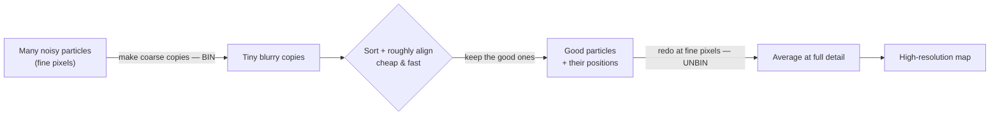

# Binning, Resolution & Precision — when coarse is fine and when it isn't

*A plain-language note on why you bin some steps hard and others not at all.*

---

## ELI5

**Binning means grouping neighboring pixels together to make a smaller, coarser
picture.** "Bin 2" merges every 2×2 block of pixels into one fat pixel, so the
picture is half as wide and carries a quarter of the data (an *eighth*, for a 3D
volume). You've blurred away the fine detail but kept the overall shape — and it's
*much* cheaper to work with.

Think of it as **photo thumbnails**:

- A thumbnail is enough to **sort** your holiday photos into albums, spot the blurry
  duds, or tell "beach" from "mountain." You don't need full resolution for those calls.
- But to **read a street sign** in the background, or **print a poster**, you need the
  full-size original — the detail you threw away making the thumbnail is exactly what
  you now need.

Flipping through thumbnails is fast; editing full-size photos is slow. So you use
thumbnails for the *sorting/finding* work and the full-size original only for the
*final detailed* work.

```
        FINE (unbinned)                 COARSE (binned ×2)
       4×4 = 16 pixels                   2×2 = 4 pixels
      ┌──┬──┬──┬──┐                      ┌─────┬─────┐
      ├──┼──┼──┼──┤    merge each        │     │     │
      ├──┼──┼──┼──┤    2×2 block  ──►    ├─────┼─────┤
      ├──┼──┼──┼──┤    into one          │     │     │
      └──┴──┴──┴──┘                      └─────┴─────┘
      sharp · expensive             blurry · 4× less data (8× in 3D)
```

### The one rule that explains everything

> **The finest detail anything can show is about two pixels wide.**

Your pixel size is a *ceiling* on detail. Coarse pixels → you can only ever see big
shapes. Fine pixels → you can see small bumps (but you pay for it).

That single rule is why binning **matters for some steps and not for others**:

```
  Question the step is asking        Does binning hurt the answer?
  ──────────────────────────────     ─────────────────────────────────
  "Which particles are good?"        No  — big shapes survive binning
  "Roughly where / which way?"       No  — you can center on a blob to
                                           better than one pixel
  "How fine is the structure?"       YES — the answer can't be finer
                                           than your pixels
```

- For **sorting / finding / rough aligning**, you only need *big* differences, and
  those survive even heavy binning. So *how much* you bin is just a **speed dial** with
  almost no downside — bin hard, go fast.
- For the **final, resolution-defining step**, the amount of binning is a **hard
  ceiling**: bin 2 caps you at ~2× worse detail, bin 4 at ~4× worse. Here every notch of
  binning is paid for directly in the quality of your result.

---

## The general principle (two sentences)

**Match the pixel size to the question.** Use the coarsest pixels that still show the
feature a step is deciding on (sorting, finding, rough alignment — cheap and lossless
*for that purpose*); switch to the finest pixels you have **only** for the final step
that measures high-resolution detail, because that result can never be finer than the
pixels you fed it.

> **Carry-anywhere version:** *bin for decisions, unbin for measurement* — and never let
> the final refinement run on binned data.

---

## Worked examples, simplest → real

### 1. Sorting (pure thumbnails)

You have a pile of particles, some real, some junk. To split them you only need "does
this look like the thing, yes or no?" — a coarse call. Bin them down to tiny blurry
copies and sort *those*. Many times faster, and you lose nothing, because real‑vs‑junk
is a big-shape difference that binning keeps.

### 2. The standard two-stage recipe

Almost every structure pipeline has the same shape: **sort & align cheaply on coarse
copies, then measure precisely on fine copies.**



The clever part: even though the coarse stage was blurry, it still pinned down *which*
particles are good and *roughly* where/which-way each one sits — and you can locate a
blob's center to better than a pixel. So the fine stage starts from good positions and
just polishes them to high resolution. Coarse early ≠ sloppy later.

### 3. This job — the 412 capsid (what actually happened)

Your particles were saved at **fine pixels** (unbinned). You then ran the **sorting**
step on them *at full resolution* — and it took ~2½ hours while only ever reaching ~17 Å
(coarse) detail.

That's exactly the mismatch from the rule above: you spent fine-pixel effort on a
coarse-pixel question.

```
   what you did                          what the task needed
   ──────────────────────                ──────────────────────
   fine pixels (slow)        ✗ mismatch   coarse pixels (fast) is
   to answer "which          ─────────►   plenty to answer
   particles are real?"                   "which are real?"
```

The fix matches pixels to the question: **sort on coarse (binned) copies** — minutes
instead of hours, identical sorting outcome — then take only the *winning* particles and
**average them at full resolution** for the final high-detail map. Sorting never needed
the fine detail; the final map is the only step that does.

### 4. (Advanced) The binning ladder

When you're chasing the highest possible resolution, you don't jump straight from
very-coarse to fine. You walk *down a ladder*, each rung using the coarsest pixels that
still support the detail you've reached so far:

```
  stage       pixels        why
  ─────────   ───────────   ────────────────────────────────────
  clean-up    very coarse   throw out junk, get rough angles — cheap
  align       coarse        improve angles; structure ~medium detail
  refine      medium        structure is finer now → needs finer pixels
  polish      fine          final push; result limited only by pixels
```

Same principle applied repeatedly: **the resolution you currently have sets the coarsest
pixels you're allowed to use next.** Fast while the structure is still coarse, fine only
once you've earned it.

---

## TL;DR

| You are asking…                    | Pixel size to use            | Binning is… |
| ---------------------------------- | ---------------------------- | ----------- |
| which / where / is-it-good (sort)  | coarsest that shows the call | a free speed dial |
| how-fine-is-it (final measurement) | the finest you have          | a hard ceiling on the answer |

*Bin for decisions, unbin for measurement.*
