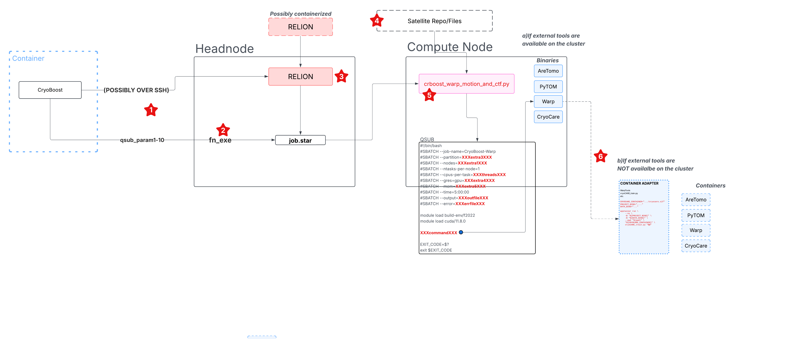
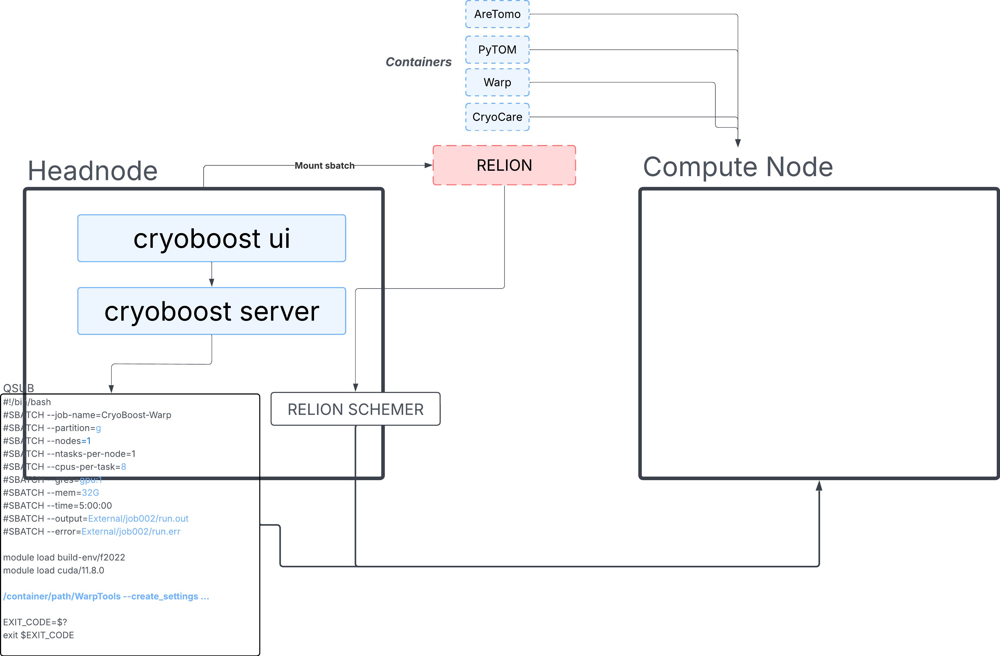

## High level overview:

The biggest change so far has of course been the switch from [the collection-of-scripts wrapping relion pipeliner and schemer, executing over ssh and serving a PyQT GUI] to the ["webserver with a structured backend component"] proposed by Florian. So far this mainly has the advantage of eliminating the need to handle ssh connections (since the server already runs on the headnode) and lent us the opportunity to:

- separte the scheduling/orchestration logic from the UI components as well as move them to the browser akin to Jupyter, CryoSparc and similar resource-intesive GUI-based applications. 

- centralize certain parts of the logic that were spread across _stages of the job preparation_.


## Some pain points in slightly more detail:

The points below very loosely refer to the red stars on the "dataflow" schematic attached (open image in new tab against white background if your GitHub is black background). I apologize about the "figure quality" here, but maybe it's helpful.




### 1. Injection of additional per-need parameters per job into the pipeline (things of the form `qsub_extra1-10`).

These were previously recorded both in conf.yaml and individual jobs as some version of defaults and post-processed by the cryoboost-the-application before the `relion_schemer` call. (https://github.com/FlorianBeckOle/CryoBoost/blob/e9682d647fd12a4cb596070c53e4d4b431defa86/src/rw/librw.py#L274-L296). Currently it's handled in a similar "aliasing/de-aliasing" manner but is now centralized to one place (project creation) and can be easily extended to accommodate non-qsub related parameters from a single config file.. [ rudimentary example here ](./services/simple_computing_service.py) and [here](./services/project_service.py#66-77), but the plan is to have these as "dataclass"/pydantic models defined per job. We could aslo separate infrastructure related (cluster) parameters fro the namespace of the operational (ex. instrument) parameters this way.

### 2. `fn_exe`. 

The main mechanism by which the command from a particular `job.star` made its way into the eventual qsub script was "hostage" to relion_schemer. That is, each particular job type's `job.star` specified its own dedicated wrapper in the [`fn_exe`](https://github.com/FlorianBeckOle/CryoBoost/blob/e9682d647fd12a4cb596070c53e4d4b431defa86/config/Schemes/warp_tomo_prep/fsMotionAndCtf/job.star#L17) section, which according to relion's rule would be invoked and its results -- substituted for the `XXXcommandXXX` template variable in the eventual qsub. That, however, meant that the `qsub.sh` script depended on the invocation of the given script specified in the `fn_exe`, namely our bespoke "wrappers" -- `crboost_warp_fs_motion_and_ctf.py` etc. -- which, in turn necessitated a python environment to run in (hence the "satellite repo"). This indirection is eliminated by just directly building the tool speicifc command (ex. `WarpTools --create_settings foo bar..`) and doing in due time this piece of work that `relion_schemer` outsourced to the wrappers in the end. Basically, we subsume the [ former "wrappers" ](./services/pipeline_orchestrator_service.py#37-82) into our own orchestration pipeline and push upstream in the dataflow. All parameter parsing logic remains the same and is as flexible as needed and can in fact be stronger typed with a pydantic model (define allowalbe ranges for certain parameters, appropriate and constrained choices for others, datatypes at the basic etc.).

### 3. Relion.

This does not concern the refactor directly, but just another portability observation. I had to opt for a public release of relion built inside a singularity container, into which i [ mount our cluster's `slurm` and `munge` ](./backend.py#142-148). This seems to a reasonable hack and is a nice degree of flexibility to know that we have. I'm glad that this proof of concept is workable because all environment variables and paths management aside, this allows us to say that "system" dependencies of cryoboost are basically just python & `apptainer`: if you can run a python environment and have singularity or docker installed -- you can use cryoboost with relion and all other external tools completely containerized.

In slightly more detail: i had a hard time combining Relion5 provided as a module on our cluster (CBE) with the rest of our python environment and had to opt for a containerized solution. In particular, there seems to be no combination of Python and GCC version that satisfies both `pyarrow` ( data-processing package that Alister Burt's newish `starfile` relies on ) and Relion module on our server (our relion module necessarily pulls in python3.10).

### 4. "Satellite Repo".

TLDR: symptom of what is described in #2.

Perhaps less of a point of pain in an all-headnode (as opposed to containerized) cryoboost setup, but the gist is that since wrappers (ex. `crboost_warp_fs_motion_and_ctf.py` ) were still present in the qsub script at the moment of a given job's dispatch (by `relion_schemer`, on the headnode) -- they needed some sort of python env to actually run in and produce/compile the command-propper ex. `WarpTools --create_settings ...`. 

In the case of "flat" all-headnode setup this environment can be the actual cryoboost environment. 

In the case that cryoboost is containerized -- its environment itself in fact lives in the container, inaccessible to the _headnode_'s(outside container) relion_schemer. Hence, one had to keep this additional host of wrappers on the headnode outside the container, which in turn used some of the other cryoboost files, hence it was easier to just duplicate the repo there, which kind of defeats the purpose of containerization.

Solution: forego outsourcing of the command construction (via `fn_exe`/`XXXcommandXXX`) to relion_schmere and do it _upstream_ of the actual job dispatch. Again, [ these ](./services/pipeline_orchestrator_service.py#37-82) become dedicate job- and tool- specific methods that we can later "stronglier" type and outfit with some validation.

### 5. Same thing as already described in 4 and 2.


### 6. The upshot of 2,4 and 5

Not doing the  `fn_exe`/`XXXcommandXXX` feint allows to cut out the need for special wrappers altogether and type invocations to the tool specific containers directly. The idea here is that the user would be able to specify in conf.yaml whether their relion and external tools [([./config/conf.yaml#224-226](https://github.com/Klumpe-lab/crboost_server/blob/5738b054bd9a95dc5f218e2f2bd8ecb86d935273/config/conf.yaml#L224-L228))](https://github.com/Klumpe-lab/crboost_server/blob/58316f5238d497f9f47ef5fa624b2cc11317c0ee/config/conf.yaml#L224-L228) are each provided by them as a binary ("flat" setup) on the system OR a container. Depending on this -- the final job invocation would then either:

- binary case: address the job-specific command to the binary tool directly.

- container case: adress the job-specifc command to the "binary" tool. Then the[  container_service will wrap ](./services/container_service.py#20-75) that command into the argument-mapping and enviroment-isolating "prelude" and pass it onto the correct container. This eliminates the need for special "adapter" files. Rather, it's the same damn thing, just subsumed into python, where it'll be a little more comfortable to implement the logic of whether a given tool is a binary or a container.

That is, it currently looks like this:
```yaml
containers:
  warp_aretomo: /groups/klumpe/software/Setup/cryoboost_containers/warp_aretomo1.0.0_cuda11.8_glibc2.31.sif
  cryocare: /groups/klumpe/software/Setup/cryoboost_containers/cryocare.sif
  pytom: /groups/klumpe/software/Setup/cryoboost_containers/pytom.sif
  relion: /groups/klumpe/software/Setup/cryoboost_containers/relion5.0_tomo.sif
```

but should eventually look like this (for example:
```
tools:
  warp:
    binary: true
    container: false
    path: /groups/joeschmoe/WarpTools
  relion:
     binary: false
     container: true
     path: /groups/klumpe/software/Setup/cryoboost_containers/relion5.0_tomo.sif
  cryocare:
    binary: true
    container: false
    path: /opt/CryoCare/cryocare_virtual_env/bin/cryocare
# etc...
```


[ Container Def Files are provided here. ](./container_defs/)



